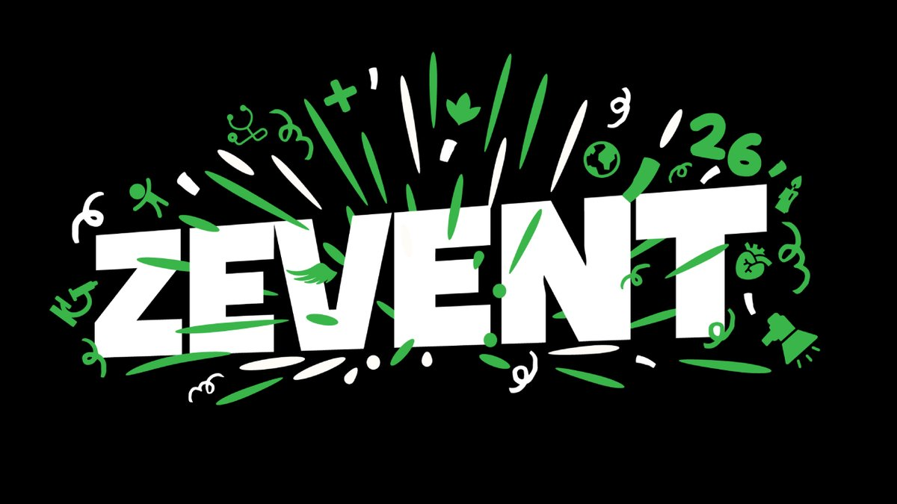
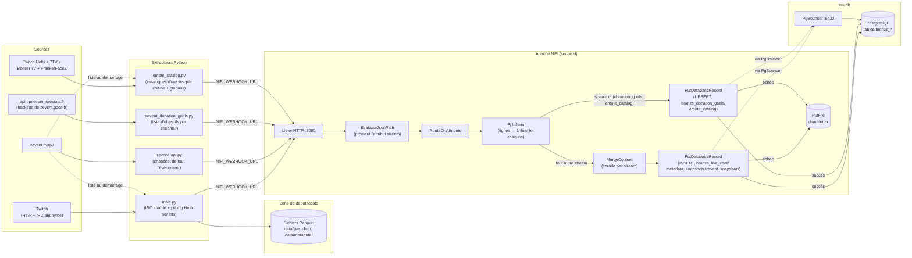
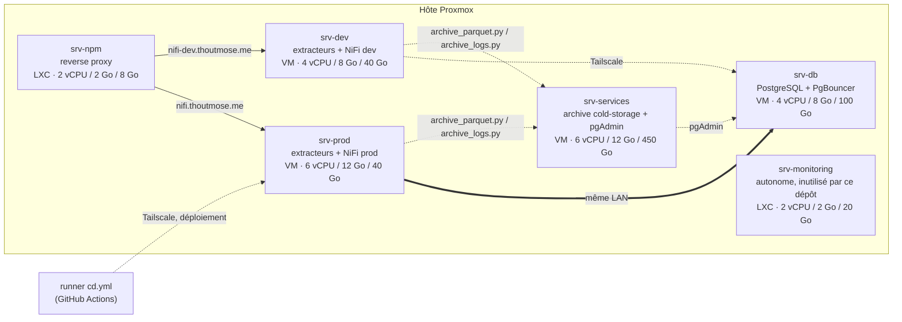

# zevent-analytics

**Un évènement, des dons, des streamers, mais aussi des viewers et chatters.**




[](https://github.com/thoutmose/zevent-analytics/actions/workflows/ci.yml)

**[English](README.md) · [Français](README.fr.md)**

Extrait les données en direct de chaque chaîne Twitch participant au
[Zevent](https://zevent.fr/) — chat, nombre de viewers, métadonnées de
stream, catalogues d'emotes, et le flux de dons/streamers de l'événement
lui-même — et les dépose dans une couche bronze PostgreSQL via un pipeline
d'ingestion Apache NiFi, avec une copie locale Parquet de tout, en
parallèle. Une couche de transformation dbt (`stg`/`int`/`marts`)
transforme ensuite cette couche bronze en surface d'analyse.

## Table des matières

- [Aperçu](#aperçu)
- [Architecture](#architecture)
- [Infrastructure](#infrastructure)
- [Choix de conception](#choix-de-conception)
- [Mécanismes de fiabilité](#mécanismes-de-fiabilité)
- [Performance](#performance)
- [Structure du projet](#structure-du-projet)
- [Démarrage](#démarrage)
  - [Prérequis](#prérequis)
  - [1. Enregistrer une application Twitch](#1-enregistrer-une-application-twitch)
  - [2. Configurer les variables d'environnement](#2-configurer-les-variables-denvironnement)
  - [3. Démarrer la stack NiFi](#3-démarrer-la-stack-nifi)
  - [4. Appliquer le schéma de base de données](#4-appliquer-le-schéma-de-base-de-données)
  - [5. Construire le flow NiFi](#5-construire-le-flow-nifi)
  - [6. Lancer les extracteurs](#6-lancer-les-extracteurs)
- [Référence de configuration](#référence-de-configuration)
- [Modèle de données](#modèle-de-données)
- [Journalisation](#journalisation)
- [Développement](#développement)
- [Limitations connues](#limitations-connues)
- [Recommandations d'efficacité et de stabilité](#recommandations-defficacité-et-de-stabilité)
- [Transformation des données (dbt)](#transformation-des-données-dbt)
- [Qualité des données](#qualité-des-données)
- [Analyse des données](#analyse-des-données)

## Aperçu

Quatre extracteurs indépendants alimentent le même pipeline :

| Script | Surveille | Source | Authentification |
|---|---|---|---|
| [`main.py`](main.py) | Toutes les chaînes de la liste Zevent en cours (300+) | Twitch Helix (polling par lots) + IRC anonyme (connexions shardées) | Device Code Flow, app-only |
| [`zevent_api.py`](zevent_api.py) | L'événement dans son ensemble | [`zevent.fr/api/`](https://zevent.fr/api/), public/non authentifié | aucune |
| [`zevent_donation_goals.py`](zevent_donation_goals.py) | Les objectifs de dons de chaque streamer | `api.ppr.evenmorestats.fr` (le backend JSON derrière [`zevent.gdoc.fr/participations`](https://zevent.gdoc.fr/participations), public/non authentifié) | aucune |
| [`emote_catalog.py`](emote_catalog.py) | Le catalogue d'emotes de chaque chaîne, plus l'ensemble global de chaque service | Twitch Helix + [7TV](https://7tv.io/), [BetterTTV](https://betterttv.com/), [FrankerFaceZ](https://www.frankerfacez.com/) | Twitch : app-only ; les services tiers sont publics/non authentifiés |

Les quatre poussent leurs lots vers un flow [Apache NiFi](https://nifi.apache.org/)
en HTTP (`NIFI_WEBHOOK_URL`) qui route, découpe et écrit dans PostgreSQL —
voir [`ARCHITECTURE.md`](ARCHITECTURE.md) pour la justification complète de
la conception (batching, backpressure, idempotence, dead-lettering). Si
elle n'est pas définie, les quatre scripts fonctionnent quand même seuls —
`main.py` écrit ses fichiers Parquet localement, les trois autres écrivent
aussi leur checkpoint local — NiFi est une sortie additive, pas une
dépendance dure.

`emote_catalog.py` récupère des *catalogues* d'emotes (quels codes
d'emotes existent, par chaîne/globalement), pas leur usage — il existe
parce que le tag IRC `emotes` de Twitch (capturé directement par `main.py`,
voir `bronze_live_chat.emotes` plus bas) ne couvre que les emotes natives
Twitch. 7TV/BetterTTV/FrankerFaceZ sont des surcouches côté client
d'extensions de chat que l'IRC/API de Twitch ignore totalement : un message
qui en utilise une est juste un token en texte brut (par ex. `monkaS`) sans
aucun tag. Faire correspondre ce token au catalogue tiers réel d'une chaîne
est une jointure côté dbt contre `bronze_emote_catalog`, pas quelque chose
que la partie Python de ce dépôt calcule.

`main.py` ne cible plus une seule chaîne codée en dur : il récupère la
liste actuelle des streamers Zevent depuis `zevent.fr/api/` au démarrage et
les surveille tous. EventSub (`stream.online`/`offline`, `channel.update`,
`channel.raid`) a été abandonné au profit du pur polling Helix une fois que
le nombre de chaînes a dépassé la centaine — s'abonner à 3-4 événements par
chaîne risque d'atteindre les limites d'abonnement par websocket à cette
échelle. Les raids ne sont donc plus suivis.

## Architecture



`srv-prod` héberge les extracteurs de prod à côté de NiFi ; PostgreSQL et
PgBouncer tournent sur un `srv-db` séparé et ne sont pas gérés par ce dépôt.
Voir [`ARCHITECTURE.md`](ARCHITECTURE.md) pour la topologie de déploiement,
la configuration du reverse-proxy, et chaque écart par rapport à la
conception d'origine.

### Le flow NiFi, processeur par processeur


Une capture en direct du flow ci-dessus (instance de dev) — les chiffres
sur chaque processeur sont des statistiques glissantes sur 5 minutes, pas
des étiquettes fixes. De gauche à droite, voici le chemin d'ingestion que
prend chaque lot des quatre extracteurs :

1. **`ListenHTTP`** — le point d'entrée d'ingestion (`NIFI_WEBHOOK_URL`).
   Chaque POST est une seule enveloppe de lot complète et autonome
   (`batch_id`, `stream`, `rows[]`) issue d'un appel
   `nifi_client.push_batch` — il n'y a rien à corréler entre requêtes.
2. **`EvaluateJsonPath`** — promeut le champ `$.stream` de l'enveloppe
   (`live_chat` / `metadata` / `zevent_snapshot` / `donation_goals` /
   `emote_catalog`) en attribut du flowfile, pour que l'étape suivante
   puisse router sans reparser le corps à chaque saut.
3. **`RouteOnAttribute`** — le seul point de branchement du flow, sur cet
   attribut `stream` : `insert` (les trois flux append-only), `upsert`
   (`donation_goals` et `emote_catalog`, les deux flux qui écrasent en
   place), ou `unmatched` pour le reste.
4. **`SplitJson`** (un par branche) — développe le tableau `rows[]` de
   l'enveloppe en un flowfile par ligne. Chaque ligne porte déjà son propre
   `batch_id` + `row_number` (défini côté Python, voir `nifi_client.py`) —
   c'est ce qui rend un lot renvoyé idempotent au niveau de la base de
   données, pas quelque chose que NiFi ferait lui-même.
5. **`MergeContent`** (branche INSERT uniquement) — réassemble les lignes de
   même `stream` que l'étape 4 vient de séparer, en un tableau JSON groupé,
   pour que `PutDatabaseRecord` émette un seul insert JDBC groupé par bin au
   lieu d'une ligne à la fois. La branche UPSERT passe directement de
   `SplitJson` à `PutDatabaseRecord` — le volume de poll de
   donation_goals/emote_catalog n'en a pas besoin. Voir
   [`ARCHITECTURE.md`, étape
   5b](ARCHITECTURE.md#5b-mergecontent--insert-branch-only-between-splitjson-insert-and-putdatabaserecord-insert).
6. **`PutDatabaseRecord`** (un par branche) — le puits. La branche INSERT
   choisit sa table cible (`bronze_live_chat_staging` pour `live_chat` /
   `bronze_metadata_snapshots` / `bronze_zevent_snapshots`) via un ternaire
   NiFi Expression Language sur l'attribut `stream`, si bien qu'un seul
   processeur couvre trois tables au lieu de trois quasi identiques —
   `live_chat` atterrit dans une table de staging `UNLOGGED` au lieu de
   `bronze_live_chat` directement, repliée périodiquement par un
   `ExecuteSQL` séparé, piloté par minuteur (voir
   [`ARCHITECTURE.md`, étape
   8](ARCHITECTURE.md#8-executesql-merge-bronze_live_chat_staging--no-incoming-connection-timer-driven)).
   La branche UPSERT fait la même astuce de choix de table entre ses deux
   tables : `bronze_donation_goals`
   (`Update Keys = participation_id, goal_id`) ou `bronze_emote_catalog`
   (`Update Keys = service, scope, channel, emote_id`). Le Record Reader des
   deux branches résout un schéma Avro explicite par nom de `stream` plutôt
   que de l'inférer — voir
   [`ARCHITECTURE.md`, étape 1b](ARCHITECTURE.md#1b-controller-service-avroschemaregistry-avroschemaregistry-ingest-streams).
7. **`UpdateAttribute`** — chaque chemin d'échec du flow (`EvaluateJsonPath`
   qui échoue sur du JSON invalide, `unmatched` de `RouteOnAttribute`, l'un
   ou l'autre `PutDatabaseRecord` qui échoue à écrire) est unifié ici avant
   de toucher le disque, en réécrivant `filename` en
   `${filename}-${UUID()}`. Ce n'est pas décoratif : `SplitJson` donne à
   chaque ligne issue d'un même lot source le *même* nom de fichier, et la
   stratégie de conflit du processeur suivant est `fail` sur un nom
   dupliqué — sans cet identifiant unique, seule la *première* ligne en
   échec par lot atteignait le disque, et toutes les autres disparaissaient
   silencieusement. Voir [`ARCHITECTURE.md`](ARCHITECTURE.md) pour les
   chiffres du moment où ça a été découvert.
8. **`PutFile` (dead-letter)** — un fichier par ligne en échec, nom
   désormais garanti unique, écrit dans `nifi/dead-letter/` pour rejeu
   manuel (voir [Limitations connues](#limitations-connues)) — pas une
   nouvelle tentative automatique.

Chaque connexion ici porte un seuil de backpressure de 500 000 flowfiles /
2 Go (relevé depuis le défaut NiFi de 10 000 flowfiles / 1 Go — voir
[`ARCHITECTURE.md`, "Tuning for higher
throughput"](ARCHITECTURE.md#tuning-for-higher-throughput) pour le pourquoi
et les chiffres de débit derrière ce choix) : ça ne s'affiche simplement pas
comme un chiffre sur un canevas au repos — NiFi ne colore une connexion
qu'une fois sa file d'attente proche du seuil. Une définition de flow pour
tout ceci est fournie dans
[`flow-templates/zevent-ingest-flow.json`](flow-templates/zevent-ingest-flow.json)
(voir [`ARCHITECTURE.md`](ARCHITECTURE.md) pour comment l'importer).

## Infrastructure

Tout ce qui précède — quatre extracteurs, le routage NiFi, le puits
PostgreSQL, et l'archivage à froid — tourne sur six invités d'un seul hôte
Proxmox, provisionnés via cloud-init (`qm`/`pct`) sans couche
Terraform/Ansible par-dessus. Les vraies adresses LAN ne figurent pas ici,
même politique que [`ARCHITECTURE.md`](ARCHITECTURE.md#topology) et pour la
même raison (ce fichier est commité dans git) — résoudre les hôtes par leur
nom Tailscale MagicDNS.



| Hôte | Rôle | Type | vCPU | RAM | Disque |
|---|---|---|---|---|---|
| `srv-dev` | Machine de dev — extracteurs + checkout de ce dépôt + NiFi dev | VM | 4 | 8 Go | 40 Go |
| `srv-prod` | Machine de prod — extracteurs + checkout de ce dépôt + NiFi prod | VM | 6 | 12 Go | 40 Go |
| `srv-db` | PostgreSQL + PgBouncer — non géré par ce dépôt | VM | 4 | 8 Go | 100 Go |
| `srv-services` | Cible cold-storage pour [`archive_parquet.py`](archive_parquet.py)/[`archive_logs.py`](archive_logs.py), plus [pgAdmin](https://www.pgadmin.org/) (`dpage/pgadmin4`, port 5050) pour l'administration Postgres ponctuelle | VM | 6 | 12 Go | 450 Go |
| `srv-npm` | Reverse proxy devant `*.thoutmose.me` | LXC | 2 | 2 Go | 8 Go |
| `srv-monitoring` | Stack de monitoring — autonome, non intégrée à ce dépôt | LXC | 2 | 2 Go | 20 Go |
| **Total** | | | **24** | **44 Go** | **658 Go** |

24 vCPU et 44 Go de RAM, répartis sur 4 VM et 2 conteneurs LXC sur une seule
machine physique, c'est l'empreinte totale pour ingérer le chat en direct
d'environ 300 chaînes, plus le polling de l'événement et des objectifs de
dons en temps réel, router le tout via NiFi, et l'écrire dans Postgres —
voir [Performance](#performance) pour le débit réel (74 msg/s en régime
soutenu, ~190 msg/s en pic) que cette empreinte supporte.

## Choix de conception

### Pourquoi Apache NiFi

Le pipeline a besoin d'un point d'entrée HTTP, d'un routage par lot selon
le type de données, et d'un puits base de données avec un chemin
dead-letter pour les échecs. NiFi fournit tout cela sous forme de
processeurs configurables (`ListenHTTP`, `RouteOnAttribute`,
`PutDatabaseRecord`, `PutFile`) au lieu de code que ce projet aurait dû
écrire et opérer lui-même — un message broker (Kafka ou équivalent)
aurait quand même besoin d'un consommateur et d'un puits base de données
construits par-dessus pour le même résultat. Le compromis est que le flow
NiFi vit dans sa propre UI/API REST plutôt que dans du code versionné —
atténué ici en documentant la configuration de chaque processeur dans
[`ARCHITECTURE.md`](ARCHITECTURE.md), puisqu'aucun export de flow ne peut
être validé sans une instance en marche pour l'importer.

### Pourquoi PostgreSQL + JSONB

PostgreSQL et PgBouncer étaient la cible imposée (voir
[`ARCHITECTURE.md`](ARCHITECTURE.md)), pas quelque chose que ce projet a
évalué face à des alternatives. C'est un bon choix pour ce dont on a
réellement besoin : `UNIQUE (batch_id, row_number)` donne une sémantique
exactly-once au rejeu gratuitement, et `jsonb` héberge le tableau
par-streamer de `zevent_api.py` (`bronze_zevent_snapshots.streamers`) sans
schéma rigide une-colonne-par-champ. Rien ici n'est écrit pour être
interrogé à échelle analytique — c'est une couche bronze/brute, pas un
entrepôt de données (l'entrepôt, c'est le rôle de dbt maintenant — voir
[Transformation des données (dbt)](#transformation-des-données-dbt)).

### Pourquoi Parquet en double écriture, pas juste un cache local

`main.py` écrivait du Parquet avant même que NiFi/PostgreSQL n'entrent en
jeu — le docstring de `nifi_client.py` lui-même le qualifie de « sortie
additive, pas un remplacement ». Garder l'écriture Parquet permet à
l'extraction de survivre à un NiFi indisponible, mal configuré, ou pas
encore déployé, et donne une copie locale compressée en zstd à partir de
laquelle rejouer, indépendamment de la base. Ça sert aussi de tampon
pendant une panne NiFi : au pic estimé de ~190 msg/s dans [Mécanismes de
fiabilité](#mécanismes-de-fiabilité), même une panne de 30 minutes ne
représente qu'environ 340 000 messages de chat, absorbés sans problème en
Parquet local. Le compromis est que les deux puits peuvent diverger si
l'un des deux échoue et pas l'autre (voir [Limitations
connues](#limitations-connues)) — acceptable pour une couche bronze
destinée à être rejouée, pas traitée comme une source de vérité unique.

### Pourquoi `zevent_donation_goals.py` appelle une API JSON plutôt que de scraper du HTML

`zevent.gdoc.fr/participations` est une SPA Nuxt rendue côté client — sa
réponse HTML ne porte aucune donnée, seulement un bundle JS qui va chercher
tout depuis `api.ppr.evenmorestats.fr` après le chargement de la page.
Scraper la page rendue signifierait faire tourner un navigateur headless
juste pour relire du JSON que la page elle-même a déjà récupéré en HTTP
brut ; appeler ce backend directement (`/events`,
`/events/{id}/donation_goals/overview`,
`/participations/{id}/donation_goals` — rétro-ingénierés depuis le bundle
JS de la SPA) est plus léger, plus rapide, et exactement la même approche
que `zevent_api.py` prend déjà contre `zevent.fr/api/` plutôt que de
scraper `zevent.fr`.

Chaque objectif porte aussi un drapeau `accomplished` (atteint ou non) —
volontairement supprimé. Ce module suit ce que *sont* les objectifs, pas à
quel point ils sont proches d'être atteints ;
`bronze_zevent_snapshots.total_donation_amount_eur` (`zevent_api.py`)
couvre déjà la progression globale.

Contrairement aux deux extracteurs append-only ci-dessus, cette table est
censée refléter uniquement l'ensemble *actuel* des objectifs, pas un
historique de chaque poll — voir `sql/002_donation_goals.sql` et [Modèle de
données](#modèle-de-données) pour comment c'est implémenté (UPSERT, pas
INSERT) et son unique lacune connue (les objectifs supprimés ne sont pas
effacés).

## Mécanismes de fiabilité

Dimensionné sur Zevent 2025 — le même format que suit Zevent 2026 : 327
chaînes, 55h de direct, 751 889 viewers au pic, 296 175 viewers en moyenne.
Au ratio approximatif de Twitch de 1 à 3 messages de chat/min pour 100
viewers (le ratio baisse quand une chaîne grossit — le chat défile trop
vite pour être lu, et le slow-mode limite souvent davantage les plus
grosses), cela place l'extraction/le chargement à environ **74 msg/s en
régime soutenu, ~190 msg/s au pic**, et le pic lui-même est une montée sur
des dizaines de minutes (cycle jour/nuit des viewers) plutôt qu'un pic
soudain — il n'y a pas de mur de trafic arrivant en quelques secondes à
concevoir.

Ce qui est réellement implémenté et testable dans ce dépôt, à la date de la
dernière réécriture multi-chaînes :

- **Rejeu idempotent** — chaque ligne porte `batch_id` + `row_number` ;
  `UNIQUE (batch_id, row_number)` (`sql/001_bronze_schema.sql`) rend un lot
  renvoyé un no-op plutôt qu'un doublon.
- **Dead-lettering, pas perte de données** — la relation `failure` de
  `PutDatabaseRecord` (et le `unmatched` de `RouteOnAttribute`) passe par un
  processeur `UpdateAttribute` qui réécrit `filename` en
  `${filename}-${UUID()}` avant d'atteindre `PutFile`, puis atterrit dans
  `nifi/dead-letter/`. L'étape `UpdateAttribute` compte car chaque ligne que
  NiFi découpe d'un même lot source hérite du `filename` d'origine de ce
  lot — sans elle, la stratégie fail-on-conflict de `PutFile` plus sa
  relation `failure` auto-terminée signifiait que seule la *première* ligne
  en échec par lot atteignait jamais le disque ; toutes les autres
  disparaissaient silencieusement (confirmé sur l'instance NiFi de dev :
  27 890 collisions de nom de fichier enregistrées contre seulement 164
  fichiers ayant réellement survécu dans `nifi/dead-letter/`). Si le flow
  NiFi de `srv-prod` a été construit de la même façon, il a probablement la
  même lacune et a besoin du même correctif.
- **L'arrêt propre attend les envois en cours** —
  [`nifi_client.wait_for_pending_pushes`](nifi_client.py) est attendu avant
  la fermeture de la boucle d'événements, pour qu'un envoi NiFi ne soit pas
  annulé en cours de requête (une requête annulée-mais-déjà-envoyée est
  ambiguë — voir le docstring de cette fonction pour le double-insert que
  ça évite).
- **IRC shardé sur des connexions qui se reconnectent, avec jitter** —
  chaque [`ChatConnection`](main.py) couvre `CHANNELS_PER_IRC_CONNECTION`
  chaînes et se reconnecte avec un backoff exponentiel avec jitter en cas
  de coupure (pause quelque part dans `[backoff, 2*backoff]`, plafonnée à
  60s, pas exactement `backoff`), si bien qu'une connexion capricieuse
  n'affecte que son propre shard, et qu'une panne partagée entre shards ne
  les renvoie pas tous vers Twitch en même temps.
- **Checkpoint de l'API Zevent** — [`zevent_api.py`](zevent_api.py) n'a
  pas de double écriture Parquet, donc `_write_checkpoint` persiste le
  dernier snapshot récupéré avec succès dans `ZEVENT_CHECKPOINT_PATH`
  (par défaut `data/zevent_checkpoint.json`) après chaque poll, via un
  fichier temporaire renommé ensuite, pour qu'un crash en cours d'écriture
  ne puisse pas le corrompre. Un redémarrage, ou une panne de
  zevent.fr/api/ (c'est arrivé pendant ~17min lors du Zevent 2024), laisse
  toujours un snapshot récent connu comme bon sur le disque.
- **Répartition consciente des limites de débit** — les appels Helix
  (`Get Users`/`Get Streams`) sont découpés en lots de 100 logins par
  requête (la limite propre de Twitch) ; les `JOIN` IRC sont cadencés
  (`IRC_JOIN_PACING_SECONDS`) pour rester sous la limite de connexion par
  10s de Twitch.
- **Backpressure native de NiFi, par connexion** — chaque connexion entre
  processeurs a un seuil objets/taille que NiFi applique nativement ;
  testée en charge de façon synthétique sur `srv-dev` (voir
  [Performance](#performance) ci-dessous), mais pas encore contre du trafic
  Zevent réel.
- **Archivage, pas accumulation** —
  [`archive_parquet.py`](archive_parquet.py)/[`archive_logs.py`](archive_logs.py)
  sont des scripts autonomes, lancés par cron (pas partie des extracteurs
  toujours actifs) : chaque exécution regroupe chaque fichier éligible en
  une seule archive tar.zst (voir
  [`archive_common.py`](archive_common.py)), la rsync vers
  `ARCHIVE_REMOTE_HOST`, confirme que son sha256 correspond à l'archive
  locale, et ne supprime les fichiers locaux d'origine qu'ensuite — un
  échec de transfert ou une non-correspondance de hash laisse chaque
  original intact et le lot entier est simplement retenté à la prochaine
  exécution. `--dry-run` rapporte ce qui serait archivé/supprimé sans rien
  toucher, étant donné que l'étape de suppression est irréversible.

## Performance

Les vrais chiffres de l'événement (débit, taux de dead-letter, nombre de
reconnexions IRC par shard, nombre de redémarrages manuels) ne sont toujours
pas mesurés — le Zevent n'a pas encore eu lieu sur cette ligne temporelle, et
cette note sera complétée après coup avec de vrais chiffres tirés de
`logging/` (voir [Journalisation](#journalisation)) et de PostgreSQL
lui-même, pas des chiffres projetés.

Ce qui *a* été mesuré : des tests de charge/capacité synthétiques du
plafond du pipeline d'ingestion via `stress_test.py` — un générateur de
charge montante qui poste des lots `live_chat` synthétiques vers `/ingest`.
Ceci exerce le pipeline lui-même (webhook → NiFi → Postgres), pas un vrai
volume de chat Twitch, mais le run en production ci-dessous a utilisé la
même infrastructure srv-prod réelle que le trafic du Zevent frappera.

| | Ligne de base non ajustée | Après réglage srv-dev (30/08/2026) | srv-prod, validé (03/09/2026) |
|---|---|---|---|
| Propre (0% d'erreur) jusqu'à | 1 producteur concurrent | 25 producteurs concurrents | **200 producteurs concurrents** |
| Débit d'écriture en base soutenu | ~4 400 lignes/s (1 producteur seulement) | ~2 700–3 000 lignes/s | **~21 800 lignes/s** |
| Taux de dead-letter en charge | n/a | n/a | 0 |

**Prêt pour le Zevent au 03/09/2026 :** 0% d'échec de requête jusqu'à 200
producteurs concurrents et ~21 800 lignes/s soutenues vers
`bronze_live_chat` sur srv-prod — confortablement au-delà de la cible de
6 000 TPS. La méthodologie complète, le mode d'échec de la ligne de base
non ajustée, chaque changement de réglage appliqué, et l'historique des
incidents derrière ces chiffres (dont deux coupures de production
rencontrées en chemin) sont dans
[`ARCHITECTURE.md`, "Stability findings and stress-test
validation"](ARCHITECTURE.md#stability-findings-and-stress-test-validation)
(en anglais).

## Structure du projet

```
.
├── main.py                  # extracteur Twitch multi-chaînes (chat + métadonnées)
├── zevent_api.py             # poller de zevent.fr/api/ (snapshot de tout l'événement)
├── zevent_donation_goals.py   # poller des objectifs de dons par streamer
├── emote_catalog.py            # poller de catalogues d'emotes Twitch/7TV/BetterTTV/FrankerFaceZ
├── archive_parquet.py        # déplace les vieux fichiers Parquet locaux vers le cold storage (cron)
├── setup_archive.sh          # configuration SSH+cron unique pour archive_parquet.py
├── nifi_client.py             # helper HTTP partagé (batching, retries-safe)
├── logging_setup.py           # charge logging.yaml, choisit le profil de handler dev/prod
├── logging.yaml                # handlers de fichiers rotatifs + console colorée
├── sql/001_bronze_schema.sql    # tables bronze PostgreSQL (appliquées sur srv-db)
├── sql/002_donation_goals.sql    # bronze_donation_goals (état courant, UPSERT)
├── sql/003_live_chat_chatter_attributes.sql  # bronze_live_chat + badges/user_type/account_created_at/broadcaster_type
├── sql/004_live_chat_emotes.sql   # bronze_live_chat + emotes (Twitch natif, depuis les tags IRC)
├── sql/005_emote_catalog.sql       # bronze_emote_catalog (état courant, UPSERT)
├── dbt/                             # couche de transformation : bronze_* -> stg/int/marts
│   ├── models/staging/                # vues 1:1 typées sur bronze_*
│   ├── models/intermediate/           # jointures, fonctions fenêtrées, agrégations
│   ├── models/marts/                  # la surface d'analyse — voir Analyse des données
│   └── dbt_project.yml, profiles.yml, packages.yml
├── run_dbt.sh                         # invoqué par le workflow dbt (manuel) / à la main
├── docker-compose.yml              # stack NiFi locale (srv-prod uniquement)
├── nifi/dead-letter/                 # échecs de PutDatabaseRecord atterrissent ici
├── drivers/                            # driver JDBC PostgreSQL, monté dans NiFi
├── openapi.yaml                          # chaque appel à l'API Twitch externe, documenté
├── ARCHITECTURE.md                         # pipeline de production cible, en détail
├── DEPLOYMENT.md                             # configuration CD : secrets, accès srv-prod
├── .github/workflows/                          # CI, CD (srv-prod), dbt (manuel)
└── data/                                         # sortie Parquet locale (gitignored)
```

## Démarrage

### Prérequis

- Python 3.12+ et [uv](https://docs.astral.sh/uv/)
- Docker + Docker Compose (pour la stack NiFi locale)
- Une instance PostgreSQL joignable derrière PgBouncer (voir
  [`ARCHITECTURE.md`](ARCHITECTURE.md) — non fournie par ce dépôt)

### 1. Enregistrer une application Twitch

Sur https://dev.twitch.tv/console/apps — mettre **Category** à
`Application Integration` et **Client Type** à `Public` (le Device Code
Flow a besoin d'un client public, sans secret client).

### 2. Configurer les variables d'environnement

```bash
cp .env.example .env
```

Renseigner au minimum `TWITCH_CLIENT_ID`. Voir [Référence de
configuration](#référence-de-configuration) ci-dessous pour le reste — la
plupart ont des valeurs par défaut raisonnables.

### 3. Démarrer la stack NiFi

```bash
uv sync
docker compose up -d
```

L'UI/API de NiFi est servie en HTTPS sur `https://localhost:8443` (certificat
auto-signé ; la connexion single-user ne fonctionne qu'en HTTPS — voir
[`ARCHITECTURE.md`](ARCHITECTURE.md#4-notes-on-this-implementation-deviations-from-the-original-spec)
pour le pourquoi). Le port d'ingestion des données (`ListenHTTP`) est
`localhost:8888`.

### 4. Appliquer le schéma de base de données

```bash
psql "postgresql://<user>@<srv-db-host>:5432/zevent" -f sql/001_bronze_schema.sql
psql "postgresql://<user>@<srv-db-host>:5432/zevent" -f sql/002_donation_goals.sql
psql "postgresql://<user>@<srv-db-host>:5432/zevent" -f sql/003_live_chat_chatter_attributes.sql
psql "postgresql://<user>@<srv-db-host>:5432/zevent" -f sql/004_live_chat_emotes.sql
psql "postgresql://<user>@<srv-db-host>:5432/zevent" -f sql/005_emote_catalog.sql
```

`003` et `004` font un `ALTER TABLE bronze_live_chat` — contrairement à
`001`/`002`/`005`, qui ne font que créer de nouvelles tables, ce qui veut
dire que le processeur `PutDatabaseRecord` (INSERT) construit à l'étape 5
ci-dessous doit être redémarré *après* les avoir appliqués, sinon son schéma
de table mis en cache laisse silencieusement tomber les nouvelles colonnes.
Voir le commentaire d'en-tête de l'un ou l'autre fichier, ou
[`ARCHITECTURE.md`, étape 6a](ARCHITECTURE.md#6a-putdatabaserecord--insert-branch-insert-relationship),
pour le pourquoi.

### 5. Construire le flow NiFi

Ce dépôt ne fournit pas de template NiFi exporté (un template écrit à la
main ne peut pas être validé sans une instance en marche pour l'importer).
Le construire selon le diagramme [Architecture](#architecture) ci-dessus —
`ListenHTTP` → `EvaluateJsonPath` → `RouteOnAttribute` → `SplitJson` →
`PutDatabaseRecord` (+ `PutFile` dead-letter sur échec) ; la branche INSERT
passe en plus par `MergeContent` entre `SplitJson` et `PutDatabaseRecord`
(voir [`ARCHITECTURE.md`, étape
5b](ARCHITECTURE.md#5b-mergecontent--insert-branch-only-between-splitjson-insert-and-putdatabaserecord-insert)).
La configuration complète des processeurs est dans
[`ARCHITECTURE.md`](ARCHITECTURE.md#2-how-the-pieces-in-this-repo-map-onto-the-diagram).
Les flux `donation_goals` et `emote_catalog` partagent une seule branche
`PutDatabaseRecord` (routée par `RouteOnAttribute` sur `stream in
('donation_goals', 'emote_catalog')`) configurée avec **Statement Type :
UPSERT** et une expression **Update Keys** par flux — voir
`sql/002_donation_goals.sql` / `sql/005_emote_catalog.sql`, ou
[`ARCHITECTURE.md`, étape 6b](ARCHITECTURE.md#6b-putdatabaserecord--upsert-branch-upsert-relationship)
pour les expressions exactes — chaque autre flux utilise un simple
`INSERT`.

### 6. Lancer les extracteurs

```bash
uv run main.py                    # toutes les chaînes Zevent : chat + métadonnées
uv run zevent_api.py              # snapshot de tout l'événement (dons, viewers)
uv run zevent_donation_goals.py   # liste des objectifs de dons de chaque streamer
uv run emote_catalog.py           # catalogues d'emotes Twitch/7TV/BetterTTV/FrankerFaceZ de chaque chaîne
```

Chacun est indépendant — lancer n'importe quel sous-ensemble. Au premier
lancement, `main.py` affiche une URL de Device Code Flow : l'ouvrir, se
connecter, autoriser. Le token est mis en cache dans `.tio.tokens.json` pour
que les lancements suivants n'aient pas besoin de ré-autoriser (tant que le
processus s'arrête proprement — voir
[`nifi_client.wait_for_pending_pushes`](nifi_client.py)).

### Exécution en tant que service (démarrage/arrêt)

Pour un événement de longue durée (le Zevent dure ~55h), les trois
extracteurs principaux tournent comme services systemd plutôt qu'en
`uv run` au premier plan. Dev et prod sont deux checkouts entièrement
séparés sur deux machines séparées — `twitch-analytics` sur `srv-dev`,
pointant vers le NiFi local de srv-dev (base `zevent-dev`), et
`twitch-analytics-prod` sur `srv-prod`, pointant vers le NiFi local de
srv-prod (base `zevent`) — chacun avec son propre `.env`. Chaque checkout a
son propre `.tio.tokens.json`, donc chacun a besoin de sa propre
approbation Twitch device-code, une seule fois. Sur srv-prod, ce même
checkout est aussi la cible du déploiement CD : la stack NiFi
(`docker-compose.yml` + `drivers/`), les extracteurs Python et les scripts
d'archivage (source, `sql/`, `dbt/`, fichiers de dépendances), et — via une
autorisation sudoers étroitement ciblée pour l'utilisateur de déploiement —
un `uv sync` suivi d'un redémarrage des trois unités systemd
`zevent-*-prod` (voir DEPLOYMENT.md) ; sur srv-dev, NiFi et les extracteurs
sont mis en place et mis à jour à la main dans son propre checkout, juste
sans CD.

```bash
# Démarrer (dev) :
sudo systemctl start zevent-api zevent-donation-goals zevent-main

# Démarrer (prod) :
sudo systemctl start zevent-api-prod zevent-donation-goals-prod zevent-main-prod

# Arrêter — les deux environnements, même schéma avec/sans le suffixe -prod :
sudo systemctl stop zevent-api zevent-donation-goals zevent-main

# Statut / suivre les logs d'un service :
sudo systemctl status zevent-main
sudo journalctl -u zevent-main -f

# Empêcher un service arrêté de redémarrer au prochain reboot :
sudo systemctl disable zevent-api-prod zevent-donation-goals-prod zevent-main-prod
```

Les six sont en `Restart=on-failure` — un crash redémarre automatiquement,
un `stop` manuel non (jusqu'au prochain reboot, sauf `disable` en plus).

**`emote_catalog.py` n'a pas encore d'unité systemd.** Contrairement aux
trois extracteurs ci-dessus, il ne fait partie ni de ces commandes
`start`/`stop`, ni de l'autorisation sudoers de DEPLOYMENT.md, ni de
l'étape « restart zevent services » de `cd.yml` — pour un vrai événement,
il lui faut sa propre `zevent-emote-catalog[-prod].service` (même modèle
que les trois autres) ajoutée aux trois endroits, ou il doit être lancé à
la main (`uv run emote_catalog.py`, en arrière-plan) à la place.

### Archivage des anciens fichiers Parquet et des sauvegardes de logs

[`archive_parquet.py`](archive_parquet.py) et
[`archive_logs.py`](archive_logs.py) sont des scripts de maintenance
ponctuels, pas des services — aucun des deux n'est installé ou planifié
par quoi que ce soit dans ce dépôt tout seul. Les deux partagent la même
mécanique tar+zstd + vérification + suppression-sur-confirmation (voir
[`archive_common.py`](archive_common.py)) et le même `ARCHIVE_REMOTE_HOST`,
seul le répertoire de destination diffère : chaque fichier éligible trouvé
en une exécution est regroupé en une seule archive datée
`<préfixe>-<timestamp>.tar.zst` (par ex.
`parquet-20260830T085635Z.tar.zst`), transférée comme ce fichier unique,
vérifiée par sha256, et alors seulement ses originaux sont supprimés
localement — une vraie sémantique de cold-storage (une archive datée par
exécution) plutôt que de nombreux petits fichiers atterrissant un par un,
et moins d'allers-retours à grande échelle. Le compromis : la vérification
et la suppression s'appliquent au lot entier d'un coup, pas fichier par
fichier — si une étape échoue, chaque original de ce lot est laissé intact
(pas seulement un), pour être retenté dans le lot (plus gros) de la
prochaine exécution.

- `archive_parquet.py` : les fichiers Parquet plus vieux que
  `ARCHIVE_MIN_AGE_SECONDS` sous `PARQUET_OUTPUT_DIR`, vers
  `ARCHIVE_REMOTE_PATH`.
- `archive_logs.py` : les sauvegardes de logs fermées/rotées sous
  `logging/` (par ex. `debug.log.3`, `debug.log.3.gz`) — jamais les
  fichiers actifs sur lesquels les handlers de
  [`logging.yaml`](logging.yaml) écrivent actuellement — vers
  `ARCHIVE_LOGS_REMOTE_PATH`. Il n'y a pas de garde-fou d'âge ici comme
  pour Parquet : une sauvegarde rotée est immuable dès qu'elle existe,
  puisque `CompressedRotatingFileHandler` n'y réécrit plus jamais.

#### Configuration unique (par machine)

Lancer [`./setup_archive.sh`](setup_archive.sh) une fois sur chaque machine
qui exécutera l'un ou l'autre script (machine de dev, `srv-prod`, ou
partout où les extracteurs tournent réellement — voir [Exécution en tant
que service](#exécution-en-tant-que-service-démarragearrêt)). C'est
idempotent — chaque étape vérifie d'abord l'état actuel, donc le relancer
(une deuxième machine, une rotation de clé, après avoir récupéré une
version plus récente du script) ne duplique jamais rien :

```bash
./setup_archive.sh
```

Il gère, dans l'ordre : générer une clé SSH dédiée à cet usage si elle
n'existe pas déjà ; ajouter un alias `Host srv-services` à `~/.ssh/config`
pour que `ARCHIVE_REMOTE_HOST=srv-services` (la valeur par défaut dans
`.env.example`) se résolve sans flag `-i` explicite nulle part ; vérifier
que l'authentification par clé fonctionne réellement ; installer les tâches
cron horaires des deux scripts (voir [Exécution](#exécution) ci-dessous) ;
et une vérification qui avertit si le `.env` d'un checkout `*-prod` n'a pas
`APP_ENV=production` défini (voir [Journalisation](#journalisation)) —
tout, sauf cette dernière vérification, est silencieux quand c'est déjà
correctement configuré.

La seule étape qu'il ne peut pas faire seul : si la clé SSH qu'il génère
n'est pas encore autorisée sur `srv-services`, il affiche la commande
`ssh-copy-id` exacte à lancer une fois (il faut un moyen d'accès existant —
une clé déjà autorisée, ou un mot de passe temporaire donné par
l'administrateur de ce serveur) et s'arrête ; relancer
`./setup_archive.sh` ensuite pour reprendre où il s'était arrêté.

Une fois l'accès SSH fonctionnel, `ARCHIVE_REMOTE_PATH` et
`ARCHIVE_LOGS_REMOTE_PATH` (voir [Référence de
configuration](#référence-de-configuration)) sont chacun créés
automatiquement sur srv-services la première fois que leur script a
réellement un fichier à y envoyer — rien à créer manuellement à l'avance.

#### Exécution

`./setup_archive.sh` installe déjà les deux ci-dessous ; montré ici pour
référence ou pour ajuster manuellement :

```bash
# Garde le lot de candidats de chaque exécution petit, ce qui compte pour
# le coût des appels SSH — voir le docstring de module de chaque script.
# Les logs passent par le même profil logging_setup.py (APP_ENV) que les
# autres scripts, donc les échecs apparaissent aussi dans
# logging/errors.log (jusqu'à ce qu'archive_logs.py archive lui-même cette
# sauvegarde, à quel point elle est sur srv-services à la place).
0 * * * * cd /path/to/twitch-analytics && uv run archive_parquet.py >> /dev/null 2>&1
0 * * * * cd /path/to/twitch-analytics && uv run archive_logs.py >> /dev/null 2>&1
```

## Référence de configuration

Toutes les variables vivent dans `.env` (voir
[`.env.example`](.env.example) pour la liste faisant autorité, commentée).
Points saillants :

| Variable | Par défaut | Rôle |
|---|---|---|
| `TWITCH_CLIENT_ID` | *(requis)* | ID client de l'application Twitch |
| `CHANNELS_PER_IRC_CONNECTION` | `50` | Chaînes par connexion IRC anonyme (shardées sur `ceil(n / this)` connexions) |
| `IRC_JOIN_PACING_SECONDS` | `0.5` | Délai entre les `JOIN` IRC, pour respecter la limite de débit de Twitch |
| `METADATA_SNAPSHOT_INTERVAL_SECONDS` | `15` | Intervalle de polling Helix par lots (toutes chaînes, toutes métadonnées) |
| `ROSTER_REFRESH_INTERVAL_SECONDS` | `15` | Fréquence à laquelle `main.py` rafraîchit la liste pour détecter de nouveaux streamers en cours d'événement |
| `CHATTER_LOOKUP_INTERVAL_SECONDS` | `30` | Fréquence à laquelle les chatteurs non résolus reçoivent un appel groupé Helix Get Users (`account_created_at`/`broadcaster_type`) |
| `ZEVENT_API_POLL_INTERVAL_SECONDS` | `20` | Intervalle de polling de `zevent.fr/api/` |
| `FLUSH_INTERVAL_SECONDS` | `30` | Fréquence à laquelle les lignes en tampon sont vidées vers Parquet/NiFi |
| `MAX_ROWS_PER_PARQUET_FILE` | `100000` | Nombre de lignes avant qu'un fichier Parquet ne tourne |
| `PARQUET_COMPRESSION` | `zstd` | Codec passé à `pyarrow.parquet.write_table` |
| `PARQUET_OUTPUT_DIR` | `data` | Zone de dépôt Parquet locale |
| `ARCHIVE_REMOTE_HOST` | `srv-services` | Destination SSH pour `archive_parquet.py`/`archive_logs.py` (un alias `~/.ssh/config` est recommandé) |
| `ARCHIVE_REMOTE_PATH` | `zevent-parquet-archive` | Répertoire distant où atterrissent les fichiers Parquet archivés |
| `ARCHIVE_MIN_AGE_SECONDS` | `600` | Âge minimum d'un fichier avant qu'`archive_parquet.py` ne l'archive |
| `ARCHIVE_LOGS_REMOTE_PATH` | `zevent-logs-archive` | Répertoire distant où atterrissent les sauvegardes de logs archivées |
| `NIFI_WEBHOOK_URL` | *(non défini)* | Point d'entrée `ListenHTTP` de NiFi ; non défini = Parquet/stdout uniquement |
| `APP_ENV` | `development` | Profil de journalisation — voir [Journalisation](#journalisation) |
| `NIFI_ADMIN_USERNAME` / `NIFI_ADMIN_PASSWORD` | — | Connexion single-user de l'UI NiFi (docker-compose) |
| `DONATION_GOALS_POLL_INTERVAL_SECONDS` | `300` | Intervalle de polling de `zevent_donation_goals.py` |
| `DONATION_GOALS_MAX_CONCURRENCY` | `5` | Nombre max de requêtes concurrentes de détail d'objectif par streamer |
| `EMOTE_CATALOG_POLL_INTERVAL_SECONDS` | `1800` | Intervalle de polling d'`emote_catalog.py` — les catalogues d'emotes sont quasi statiques, contrairement à tout le reste que ce dépôt sonde |
| `EMOTE_CATALOG_MAX_CONCURRENCY` | `10` | Nombre max de requêtes concurrentes de catalogue d'emotes par chaîne (les quatre services combinés) |
| `POSTGRES_HOST` / `PGBOUNCER_PORT` / `POSTGRES_DB` / `POSTGRES_USER` / `POSTGRES_PASSWORD` | — | Lues par aucun script Python — seulement par `dbt/profiles.yml` (`env_var()`) et, pour les humains, la config du `DBCPConnectionPool` de NiFi |
| `DBT_TARGET` | `dev` | Quelle sortie de `dbt/profiles.yml` utiliser — `dev` = `zevent-dev`, `prod` = `zevent` (voir [Transformation des données (dbt)](#transformation-des-données-dbt)) |

## Modèle de données

Cinq tables dans PostgreSQL, une par valeur de `stream` poussée via NiFi.

`bronze_live_chat`, `bronze_metadata_snapshots`, et
`bronze_zevent_snapshots` (`sql/001_bronze_schema.sql`) sont append-only :
chaque ligne porte `batch_id` + `row_number`, et
`UNIQUE (batch_id, row_number)` rend un lot rejoué un no-op plutôt qu'un
doublon.

| Table | Alimentée par | Colonnes notables |
|---|---|---|
| `bronze_live_chat` | `main.py` (IRC) | `channel`, `chatter`, `chatter_id`, `message_text`, `message_sent_at`, `captured_at`, `badges` (`jsonb`, extrait du tag IRC `badges` — par ex. `moderator`, `subscriber`, `vip`, `founder`, `partner`, `turbo`, `premium`, `broadcaster`, `staff`, `admin`), `user_type` (tag IRC `user-type` : `staff`/`admin`/`global_mod`/vide), `emotes` (`jsonb`, `{emote_id: nombre_d_occurrences}` extrait du tag IRC `emotes` — emotes natives Twitch uniquement ; les emotes tierces n'ont aucun tag du tout, voir `bronze_emote_catalog` plus bas), `account_created_at`, `broadcaster_type` (`affiliate`/`partner`/vide — les deux via une recherche Helix Get Users mise en cache, voir `CHATTER_LOOKUP_INTERVAL_SECONDS`) |
| `bronze_metadata_snapshots` | `main.py` (polling Helix) | `channel`, `is_live`, `title`, `category`, `viewer_count`, `duration_seconds`, `stream_started_at`, `snapshot_at` |
| `bronze_zevent_snapshots` | `zevent_api.py` | `website_mode`, `total_donation_amount_eur`, `total_viewer_count`, `streamers` (`jsonb` : `twitch_id`, `twitch_login`, `display_name`, `profile_url`, `online`, `game`, `viewer_count`, `donation_amount_eur` par streamer) |

`bronze_donation_goals` (`sql/002_donation_goals.sql`) est différente :
elle ne contient que l'ensemble *actuel* des objectifs, pas un historique
de chaque poll. `UNIQUE (participation_id, goal_id)` est la clé UPSERT du
`PutDatabaseRecord` NiFi (voir [étape 5](#5-construire-le-flow-nifi)), donc
un nouveau poll écrase chaque ligne d'objectif en place.

| Table | Alimentée par | Colonnes notables |
|---|---|---|
| `bronze_donation_goals` | `zevent_donation_goals.py` | `participation_id`, `streamer_name`, `twitch_login`, `twitch_id`, `goal_id`, `goal_name`, `goal_amount_eur`, `goal_category`, `snapshot_at` |

`bronze_emote_catalog` (`sql/005_emote_catalog.sql`) pose le même genre de
problème : seulement le catalogue d'emotes *actuel* par service/chaîne, pas
un historique. `UNIQUE (service, scope, channel, emote_id)` est la clé
UPSERT. `channel` est délibérément `NOT NULL` — un sentinel `'__global__'`
pour les lignes `scope = 'global'`, pas `NULL` — puisque Postgres traite
`NULL` comme distinct de `NULL` dans une contrainte `UNIQUE`, ce qui
transformerait silencieusement chaque nouveau poll des ensembles globaux en
nouvelles insertions en double au lieu de mises à jour en place. Voir le
commentaire d'en-tête de ce fichier.

| Table | Alimentée par | Colonnes notables |
|---|---|---|
| `bronze_emote_catalog` | `emote_catalog.py` | `service` (`twitch`/`7tv`/`bttv`/`ffz`), `scope` (`global`/`channel`), `channel`, `emote_id`, `emote_code`, `fetched_at` |

## Journalisation

Configurée de façon centralisée par
[`logging_setup.py`](logging_setup.py) à partir de
[`logging.yaml`](logging.yaml) — chaque logger de module
(`zevent_extractor`, `nifi_client`, `zevent_api`, `zevent_donation_goals`,
`emote_catalog`, `twitchio.*`) remonte vers le logger racine, qui détermine
réellement où va la sortie.

Deux profils, sélectionnés via `APP_ENV` :

- **`development`** (par défaut) — console colorée, plus des fichiers
  rotatifs sous `logging/` : `info.log`, `warn.log`, `errors.log`,
  `critical.log`, `debug.log`.
- **`production`** — console + `logging/info.log` uniquement.

Chaque fichier tourne à 10 Mo, en gardant 20 sauvegardes.

## Développement

```bash
uv sync --group dev     # ruff, ty, sqlfluff, pytest, bandit, pip-audit

uv run ruff format .    # formatage
uv run ruff check .     # linting
uv run ty check .       # vérification de types statique
uv run sqlfluff lint sql/  # lint SQL
uv run pytest            # tests unitaires (tests/)
uv run bandit -c pyproject.toml -r .  # lint de sécurité statique
uv run pip-audit --strict             # scan de vulnérabilités des dépendances
```

Tout ce qui précède est censé passer proprement sur chaque fichier de ce
dépôt — CI ([`.github/workflows/ci.yml`](.github/workflows/ci.yml))
exécute les mêmes vérifications, plus le lint OpenAPI, la validation
`docker-compose.yml`/YAML, et le scan de secrets, à chaque push et pull
request. Voir [`CONTRIBUTING.md`](CONTRIBUTING.md) (en anglais) pour le
workflow local complet. CD ([`.github/workflows/cd.yml`](.github/workflows/cd.yml))
déploie la stack NiFi, les extracteurs Python, `dbt/`, et les scripts
d'archivage vers srv-prod après le succès de CI sur `main` — en appliquant
chaque migration de `sql/` contre srv-db, en redémarrant NiFi sans condition
pour que son schéma de table en cache ne puisse jamais être périmé, en
rafraîchissant les dépendances, et en redémarrant les trois unités systemd
`zevent-*-prod` — avec une approbation manuelle comme verrou — voir
[`DEPLOYMENT.md`](DEPLOYMENT.md) pour la configuration et le
fonctionnement. Un workflow séparé, `dbt (manuel)`, ne se déclenche que
manuellement (`workflow_dispatch`, jamais sur push/PR/planification) pour
lancer `dbt build` sur srv-prod — voir [Transformation des données
(dbt)](#transformation-des-données-dbt).

## Limitations connues

- **Parquet et PostgreSQL peuvent diverger.** Le fichier Parquet est écrit
  en premier, puis poussé vers NiFi — si cet envoi échoue ou expire, la
  ligne existe localement mais pas (encore, ou jamais) dans Postgres. Les
  échecs que NiFi reçoit bien atterrissent dans `nifi/dead-letter/` pour un
  rejeu manuel ; rien ne réconcilie automatiquement les deux puits.
- **Les ajouts à la liste sont pris en direct, pas les retraits.**
  `main.py` rafraîchit la liste toutes les `ROSTER_REFRESH_INTERVAL_SECONDS`
  (15s par défaut) et commence à surveiller tout nouveau streamer sans
  redémarrage (`_roster_refresh_loop`, `_refresh_roster`) — mais un
  streamer qui sort de `zevent.fr/api/` n'est jamais dé-surveillé ; sa
  connexion IRC et son polling Helix continuent de tourner jusqu'au
  redémarrage du processus. Volontaire : une chaîne absente d'une seule
  réponse est bien plus probablement un aléa transitoire de l'API qu'un
  vrai retrait, et un streamer qui a réellement arrêté apparaît déjà comme
  hors ligne via le snapshot de métadonnées.
- **Pas de suivi des raids.** Abandonné en même temps qu'EventSub quand le
  nombre de chaînes a rendu les abonnements par chaîne impraticables (voir
  [Aperçu](#aperçu)).
- **Pas de *nombre* de dons.** `zevent.fr/api/` n'expose qu'un *montant*
  cumulé de dons, par streamer et pour tout l'événement — pas un décompte
  des dons individuels. `stats.zevent.fr` a plus de détail mais se trouve
  derrière un challenge anti-bot interactif qui n'est pas scripté ici.
- **Pas de « typologie de viewer »** (lurker vs. chatteur, nouveau vs.
  récurrent) — Twitch n'expose pas de liste complète des viewers, seulement
  les chatteurs actifs, et seulement via un endpoint réservé aux
  modérateurs.
- **Les objectifs de dons supprimés ne sont pas effacés.**
  `bronze_donation_goals` est maintenue à jour par UPSERT, avec pour clé
  `(participation_id, goal_id)` — si un objectif est ensuite retiré côté
  `zevent.gdoc.fr`, sa ligne cesse simplement d'être mise à jour plutôt que
  d'être supprimée. Pas censé poser problème en pratique (les objectifs ne
  sont observés qu'à être ajoutés à mesure que l'événement approche), mais
  une ligne périmée nécessiterait un `DELETE` manuel.
- **Les emotes supprimées ne sont pas effacées non plus**, pour la même
  raison. `bronze_emote_catalog` est maintenue à jour par UPSERT, avec pour
  clé `(service, scope, channel, emote_id)` — une emote supprimée ou
  renommée en amont (par Twitch, 7TV, BetterTTV, ou FrankerFaceZ) laisse une
  ligne périmée plutôt que d'être retirée, puisqu'aucune des quatre sources
  n'expose d'endpoint « qu'est-ce qui a changé » pour le détecter.
- **`api.ppr.evenmorestats.fr` n'est ni documentée ni officielle.** C'est le
  backend que `zevent.gdoc.fr` (un site compagnon tiers, pas géré par
  Zevent lui-même) se trouve appeler — rétro-ingénieré depuis son bundle
  JS, pas une API publiée/versionnée. Elle pourrait changer de forme ou
  disparaître sans préavis ; `zevent_donation_goals.py` n'est pas protégée
  contre ça au-delà d'une gestion normale des `aiohttp.ClientError`.

## Recommandations d'efficacité et de stabilité

Non implémenté — une revue de ce qui manque réellement, en plus de ce qui
est déjà couvert dans [Mécanismes de fiabilité](#mécanismes-de-fiabilité)
et [Limitations connues](#limitations-connues) ci-dessus :

- **L'épuisement du disque local n'est pas surveillé.** Si
  `ARCHIVE_REMOTE_HOST` devient injoignable pendant une période prolongée,
  `archive_parquet.py` laisse correctement les fichiers en place plutôt que
  de les perdre (voir [Mécanismes de
  fiabilité](#mécanismes-de-fiabilité)) — mais rien n'alerte sur une
  croissance non bornée de `data/` entretemps. Un disque local plein arrête
  silencieusement les nouvelles écritures Parquet (et, en aval, les
  nouveaux envois NiFi) plutôt que d'échouer bruyamment. Mérite une simple
  vérification d'usage disque (cron ou alerte côté NiFi/Postgres) une fois
  qu'`archive_parquet.py` est en usage régulier.
- **La dérive Parquet/Postgres n'a pas de réconciliation.** Déjà signalé
  comme limitation connue ; concrètement, une tâche périodique comparant
  le nombre de lignes Parquet (ou les `batch_id`) aux tables `bronze_*`
  transformerait « rien ne réconcilie automatiquement les deux puits » en
  une lacune détectable, pas seulement théorique.
- **Pas de métriques distinctes des fichiers de logs.** Le débit, le taux
  de dead-letter, et le nombre de reconnexions (voir
  [Performance](#performance)) sont tous censés être tirés de `logging/`
  et de PostgreSQL après coup — il n'y a pas de compteur/jauge en direct
  pendant l'événement lui-même, donc un problème en train de se développer
  (par ex. un shard IRC bloqué) n'est visible qu'en suivant les logs, pas
  en jetant un œil à un tableau de bord.
- **La backpressure NiFi a été testée en charge synthétiquement ; le
  dimensionnement du pool PgBouncer, lui, reste non vérifié en charge
  réelle.** La backpressure par connexion de NiFi et le dimensionnement de
  son `DBCPConnectionPool` ont maintenant été testés en charge de façon
  synthétique (voir [Performance](#performance) — ~21 800 lignes/s en
  régime soutenu sur srv-prod), mais ça n'exerce que le côté NiFi de la
  connexion JDBC ;
  la config propre du pool de PgBouncer sur `srv-db` (non gérée par ce
  dépôt) face à ce même débit n'a pas été vérifiée séparément.
- **Les plus gros modèles dbt peuvent déborder sur disque (tri/hash) sous
  le `work_mem` de srv-db, dimensionné pour l'ingestion (32MB).** Aucun
  rôle Postgres n'est dédié à dbt — il partage `zevent_user` avec
  l'ingestion NiFi — donc augmenter `work_mem` pour dbt seul demanderait
  soit un nouveau rôle, soit un `SET` scopé à la session dans un hook dbt,
  ni l'un ni l'autre appliqué pour l'instant ; voir
  [`INCIDENT.md`](INCIDENT.md#2026-09-05-evening--repeated-full-table-scans-of-bronze_live_chat-and-unresolved-work_mem-spill-on-dbt-runs).

## Transformation des données (dbt)

`dbt/` transforme `bronze_*` (dans `public`, alimentée par les quatre
extracteurs ci-dessus) en trois schémas — `stg`/`int`/`marts`, pas le
nommage par défaut de dbt `<schéma_cible>_stg` (voir
`dbt/macros/generate_schema_name.sql`). Adaptateur Postgres
(`dbt-postgres`), mêmes informations de connexion que les extracteurs
(`POSTGRES_HOST`/`PGBOUNCER_PORT`/`POSTGRES_DB`/`POSTGRES_USER`/
`POSTGRES_PASSWORD` — voir [Référence de
configuration](#référence-de-configuration)), lues via `env_var()` dans
`dbt/profiles.yml`, ce qui est sûr à commiter (aucun identifiant en clair
dedans) et cible `dev` (`zevent-dev`) par défaut, `prod` (`zevent`) via
`DBT_TARGET=prod`.

```bash
uv sync --group dbt
set -a && source .env && set +a   # dbt/profiles.yml lit ces variables via env_var()
cd dbt
uv run dbt deps    # installe packages.yml : dbt-utils, dbt-expectations, elementary
uv run dbt build   # exécute chaque modèle + test, de staging à marts
```

- **`stg_bronze__*`** (5 modèles) : des vues 1:1 typées sur chaque table
  `bronze_*` — sauf `stg_bronze__live_chat`, matérialisée en table car 14
  refs en aval contre une vue re-scannaient chacune la table source
  complète (2GB) à chaque `dbt build` ; voir
  [`INCIDENT.md`](INCIDENT.md#2026-09-05-evening--repeated-full-table-scans-of-bronze_live_chat-and-unresolved-work_mem-spill-on-dbt-runs) —
  plus une vraie transformation — `stg_bronze__zevent_snapshots` déplie le
  tableau jsonb `streamers` en une ligne par streamer par snapshot.
- **`int_*`** (19 modèles) : les vraies jointures/fonctions
  fenêtrées/agrégations — deltas de dons et rang au classement depuis des
  snapshots successifs, agrégations horaires de chat/viewers, agrégats au
  niveau chatteur et chatteur×chaîne, usage des emotes (Twitch natif +
  correspondance de token contre `bronze_emote_catalog` pour les tierces) et
  couverture du catalogue, transferts de chaîne inférés, recouvrement
  d'audience par paire de chaînes à l'échelle de l'événement (indice de
  Jaccard), écarts entre sessions de streamers, changements du
  website_mode propre à zevent.fr, et chat entre streamers.
- **`mart_*`** (38 modèles) : la vraie surface d'analyse — voir plus bas.

Deux `vars` au niveau du projet (`dbt/dbt_project.yml`) gardent les choix
arbitraires réglables sans toucher au SQL : `chatter_profile_*_max_channels`
(les seuils sedentaire/multi_streamer/semi_nomade/nomade) et
`chatter_migration_max_gap_minutes` (à quel point deux messages sur des
chaînes différentes doivent être proches pour compter comme un transfert
inféré).

**dbt ne se déclenche jamais automatiquement, nulle part** — pas de hook
on-commit/on-push, pas d'étape CI, pas de planification. En local, c'est le
`uv run dbt build` ci-dessus. Sur srv-prod, c'est le workflow GitHub Actions
[`dbt (manuel)`](.github/workflows/dbt.yml) — `workflow_dispatch`
uniquement, déclenché depuis l'onglet Actions quand quelqu'un le décide,
jamais enchaîné après CI ou CD — voir [DEPLOYMENT.md, « Running
dbt »](DEPLOYMENT.md#running-dbt). Le déploiement normal de CD synchronise
quand même le code de `dbt/` vers srv-prod à chaque fusion sur `main` (voir
[DEPLOYMENT.md](DEPLOYMENT.md)) ; cette synchronisation et l'exécution
effective de dbt sont deux actions séparées, délibérément découplées.

## Qualité des données

Chaque modèle ci-dessus porte des tests, exécutés dans le cadre de
`dbt build` : génériques (`unique`, `not_null`, `accepted_values`),
`dbt_utils.unique_combination_of_columns` sur la vraie granularité de
chaque modèle (par ex. `(chatter_id, channel)`, `(service, scope, channel,
emote_id)`), et des vérifications de plage `dbt_expectations` sur les
valeurs qui ne devraient jamais être négatives (par ex.
`donation_delta_eur >= 0`). `elementary` tourne à chaque `dbt build` (ses
propres modèles font partie du DAG) pour préparer la détection d'anomalies,
même s'il a besoin de plusieurs exécutions dans le temps pour se
construire une référence — une seule exécution n'a pas encore de données
historiques auxquelles se comparer.

Deux constats de qualité des données révélés *par* ces tests/modèles, pas
par inspection manuelle :

- **Les chaînes de test de charge de `stress_test.py` peuvent fuiter dans
  l'analyse réelle** si son propre nettoyage suggéré (`DELETE FROM
  bronze_live_chat WHERE channel = 'stress-test-...'`, imprimé par le
  script lui-même) n'est pas exécuté — une chaîne `stress-test-*` est
  apparue dans `mart_chat__engagement_vs_donations` avec des millions de
  messages en une seule heure pendant le développement. Pas filtrée dans
  `stg_bronze__live_chat` par défaut ; ajouter un `WHERE channel NOT LIKE
  'stress-test-%'` là si les tests de charge et l'analyse réelle doivent
  coexister dans la même base.
- **`mart_donations__reconciliation`** (total de l'événement vs. somme des
  montants par streamer, par snapshot) est exactement ce genre de
  vérification transformée en mart interrogeable plutôt qu'une comparaison
  ponctuelle — une divergence signifierait des dons atterris sur la
  cagnotte globale de l'événement sans être attribués à un streamer.

## Analyse des données

La couche `mart_*` est la vraie surface d'analyse — chaque mart ci-dessous
n'est qu'à un `SELECT`, sans agrégation restante à faire côté client
(cohérent avec la direction Streamlit/`st.cache_data`-sur-requêtes-déjà-
agrégées esquissée avant que cette couche n'existe).

| Sujet | Marts | Couvre |
|---|---|---|
| Dons | `donations__timeseries`, `donations__by_title`, `donations__normalized`, `donations__spike_moments`, `donations__rank_churn`, `donations__reconciliation`, `donation_goals__current`, `donation_goals__by_category`, `donations__goal_ambition_vs_reality` | Totaux + vélocité dans le temps, quels titres/catégories ont attiré le plus, efficacité par viewer/par chatteur, les plus gros pics de vélocité avec contexte, volatilité du classement, vérification qualité total-événement-vs-somme-des-parties, objectifs actuels et leurs catégories |
| Chat | `chat__engagement_vs_donations`, `chat__emote_trends`, `chat__emote_catalog_utilization`, `chat__new_chatters_per_channel`, `chat__badge_and_verbosity`, `chat__spikes` | Volume de messages vs. vélocité des dons (l'hypothèse de dimensionnement derrière le propre modèle de fiabilité de ce projet, testée contre de vraies données), tendances d'emotes (natives + 7TV/BetterTTV/FrankerFaceZ), inventaire d'emotes enregistrées-vs-utilisées par chaîne/service, croissance de l'audience de chat par chaîne, mix badge/abonné et verbosité, pics d'activité par chaîne (z-score contre la propre référence de la chaîne) |
| Chatteurs | `chatters__profile`, `chatters__leaderboard`, `chatters__account_age_profile`, `chatters__retention`, `chatters__breadth_depth_lifespan`, `chatters__bot_signal` | Classification sedentaire/multi_streamer/semi_nomade/nomade, rang par chaîne et à l'échelle de l'événement, tranches d'âge de compte, comportement de retour jour après jour, largeur vs. profondeur et durée de vie, signaux faibles de bot/compte-jetable (pas un classificateur) |
| Streamers/streams | `streamers__profile`, `streamers__diurnal_profile`, `streamers__night_shift`, `streamers__downtime_patterns`, `streams__viewership_timeseries`, `streams__category_timeline`, `streams__session_analysis`, `streams__category_cooccurrence`, `streams__concurrency_vs_performance`, `streams__liveness_reconciliation` | Résumé une-ligne-par-streamer (dons/chat/viewers/uptime/diversité de catégorie en un seul endroit), nombre de viewers indexé contre la référence événementielle à cette même heure de la journée (sépare « gros à 21h » d'une performance vraiment hors norme), efficacité des dons de nuit, écarts entre sessions, rang de viewers dans le temps, annotations de changement de catégorie/titre, durée/décroissance de viewers/rythme de chat/dons par session, quels jeux étaient joués simultanément sur les chaînes, concurrence vs. performance par chaîne, vérification croisée de la liveness Helix-vs-zevent.fr |
| Communauté/transversal | `community__channel_network`, `community__hourly_network`, `community__chatter_migrations`, `community__streamer_support_network`, `event__daily_rollup`, `event__phase_segmentation`, `event__mode_timeline` | Recouvrement d'audience chaîne-à-chaîne à l'échelle de l'événement (Jaccard — quels streamers partagent effectivement une même audience), version horaire du même, graphe de flux de transferts de chaîne inférés (le meilleur proxy disponible pour la donnée de raid qu'EventSub aurait donnée), graphe dirigé de chat entre streamers, agrégation quotidienne sur l'événement, segmentation de la vélocité des dons en ouverture/milieu/dernière ligne droite, phases du website_mode de zevent.fr avec mouvement des dons/viewers par segment |

Deux choses que chaque mart de ce tableau hérite de ce qu'il y a dessous,
qui méritent d'être répétées ici plutôt que seulement dans le commentaire
de chaque modèle : ils représentent les chatteurs qui ont **écrit**, pas
l'audience complète (Twitch n'expose aucune liste de viewers silencieux —
voir [Limitations connues](#limitations-connues)), et
`bronze_donation_goals`/`bronze_emote_catalog` sont toutes deux en
UPSERT/état-courant, donc rien de ce qui en dérive n'a de véritable
historique avant que la ligne n'ait été observée pour la première fois.
