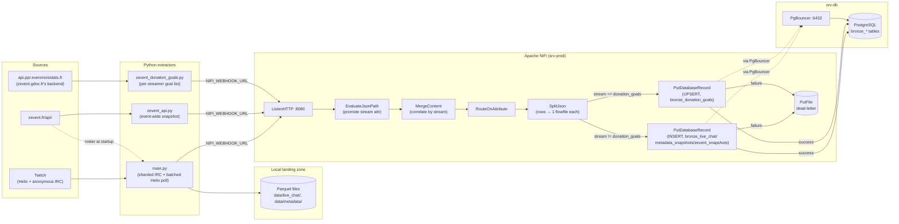
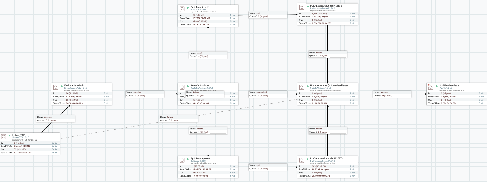

# twitch-analytics


[](https://github.com/thoutmose/twitch-analytics/actions/workflows/ci.yml)

Extracts live-stream data for every Twitch channel participating in
[Zevent](https://zevent.fr/) — chat, viewer counts, stream metadata, and the
event's own donation/streamer feed — and lands it in a PostgreSQL bronze
layer through an Apache NiFi ingestion pipeline, with a local Parquet copy
of everything along the way.

## Table of contents

- [Overview](#overview)
- [Architecture](#architecture)
- [Design decisions](#design-decisions)
- [Reliability mechanisms](#reliability-mechanisms)
- [Performance](#performance)
- [Project structure](#project-structure)
- [Getting started](#getting-started)
  - [Prerequisites](#prerequisites)
  - [1. Register a Twitch application](#1-register-a-twitch-application)
  - [2. Configure environment variables](#2-configure-environment-variables)
  - [3. Bring up the NiFi stack](#3-bring-up-the-nifi-stack)
  - [4. Apply the database schema](#4-apply-the-database-schema)
  - [5. Build the NiFi flow](#5-build-the-nifi-flow)
  - [6. Run the extractors](#6-run-the-extractors)
- [Configuration reference](#configuration-reference)
- [Data model](#data-model)
- [Logging](#logging)
- [Development](#development)
- [Known limitations](#known-limitations)

## Overview

Three independent extractors feed the same pipeline:

| Script | Watches | Source | Auth |
|---|---|---|---|
| [`main.py`](main.py) | Every channel in the current Zevent roster (300+) | Twitch Helix (batched polling) + anonymous IRC (sharded connections) | Device Code Flow, app-only |
| [`zevent_api.py`](zevent_api.py) | The whole event at once | [`zevent.fr/api/`](https://zevent.fr/api/), public/unauthenticated | none |
| [`zevent_donation_goals.py`](zevent_donation_goals.py) | Every streamer's donation goals | `api.ppr.evenmorestats.fr` (the JSON backend behind [`zevent.gdoc.fr/participations`](https://zevent.gdoc.fr/participations), public/unauthenticated) | none |

All three push their batches to an [Apache NiFi](https://nifi.apache.org/)
flow over HTTP (`NIFI_WEBHOOK_URL`) which routes, splits, and writes them
into PostgreSQL — see [`ARCHITECTURE.md`](ARCHITECTURE.md) for the full
design rationale (batching, backpressure, idempotency, dead-lettering). Left
unset, all three scripts still run standalone — `main.py` lands Parquet
files locally, the other two still write their local checkpoint — NiFi is
an additive sink, not a hard dependency.

`main.py` no longer targets a single hardcoded channel: it fetches the
current Zevent streamer list from `zevent.fr/api/` at startup and watches
all of them. EventSub (`stream.online`/`offline`, `channel.update`,
`channel.raid`) was dropped in favor of pure Helix polling once the channel
count crossed into the hundreds — subscribing to 3–4 events per channel
risks per-websocket subscription limits at that scale. Raids aren't tracked
as a result.

## Architecture



`srv-prod` runs NiFi only; PostgreSQL and PgBouncer run on a separate
`srv-db` and aren't managed by this repo. See
[`ARCHITECTURE.md`](ARCHITECTURE.md) for the deployment topology, the
reverse-proxy setup, and every deviation from the original design.

### The NiFi flow, processor by processor



A live capture of the flow above (dev instance) — the numbers on each
processor are 5-minute rolling stats, not fixed labels. Left to right, this
is the ingestion path every batch from all three extractors takes:

1. **`ListenHTTP`** — the ingestion endpoint (`NIFI_WEBHOOK_URL`). Each POST
   is one complete, self-contained batch envelope (`batch_id`, `stream`,
   `rows[]`) from one `nifi_client.push_batch` call, not a stream of
   individual events — there's nothing to correlate across requests.
2. **`EvaluateJsonPath`** — promotes the envelope's `$.stream` field
   (`live_chat` / `metadata` / `zevent_snapshot` / `donation_goals`) onto the
   flowfile as an attribute, so the next step can route without re-parsing
   the body on every hop.
3. **`RouteOnAttribute`** — the only branch point in the flow, on that
   `stream` attribute: `insert` (the three append-only streams), `upsert`
   (`donation_goals`, the one stream that overwrites in place), or
   `unmatched` for anything else.
4. **`SplitJson`** (one per branch) — expands the envelope's `rows[]` array
   into one flowfile per row. Each row already carries its own `batch_id` +
   `row_number` (set Python-side, see `nifi_client.py`) — that's what makes
   a re-sent batch idempotent at the database layer, not anything NiFi does.
5. **`PutDatabaseRecord`** (one per branch) — the sink. The INSERT branch
   picks its target table (`bronze_live_chat` / `bronze_metadata_snapshots` /
   `bronze_zevent_snapshots`) with a NiFi Expression Language ternary on the
   `stream` attribute, so one processor covers three tables instead of three
   near-identical ones. The UPSERT branch always writes
   `bronze_donation_goals` with `Update Keys = participation_id, goal_id`.
6. **`UpdateAttribute`** — every failure path in the flow (`EvaluateJsonPath`
   failing on unparseable JSON, `RouteOnAttribute`'s `unmatched`, either
   `PutDatabaseRecord` failing to write) is unified here before touching
   disk, rewriting `filename` to `${filename}-${UUID()}`. This isn't
   decorative: `SplitJson` gives every row from one batch the *same*
   filename, and the next processor's conflict strategy is `fail` on a
   duplicate name — without a uniquifier, only the first failing row per
   batch ever reached disk and every other one was silently destroyed. See
   [`ARCHITECTURE.md`](ARCHITECTURE.md) for the numbers from when this was
   found.
7. **`PutFile` (dead-letter)** — one file per failed row, name now
   guaranteed unique, written to `nifi/dead-letter/` for manual replay (see
   [Known limitations](#known-limitations)) — not an automated retry.

Every connection here carries NiFi's default backpressure (10,000 flowfiles
/ 1 GB): it just doesn't render as a number on an idle canvas — NiFi only
color-codes a connection once its queue nears the threshold. A flow
definition for all of this ships at
[`flow-templates/zevent-ingest-flow.json`](flow-templates/zevent-ingest-flow.json)
(see [`ARCHITECTURE.md`](ARCHITECTURE.md) for how to import it).

## Design decisions

### Why Apache NiFi

The pipeline needs an HTTP ingestion endpoint, per-batch routing by data
type, and a database sink with a dead-letter path for failures. NiFi
provides all of that as configurable processors (`ListenHTTP`,
`RouteOnAttribute`, `PutDatabaseRecord`, `PutFile`) instead of code this
project would otherwise have to write and operate itself — a message
broker (Kafka or similar) would still need a consumer and a
database-writing sink built on top of it for the same result. The
trade-off is that NiFi's flow lives in its own UI/REST API rather than in
version-controlled code — mitigated here by documenting every processor's
configuration in [`ARCHITECTURE.md`](ARCHITECTURE.md) since no flow export
can be validated without a running instance to import it into.

### Why PostgreSQL + JSONB

PostgreSQL and PgBouncer were the given target (see
[`ARCHITECTURE.md`](ARCHITECTURE.md)), not something this project
evaluated against alternatives. It's a good fit for what's actually
needed: `UNIQUE (batch_id, row_number)` gives exactly-once semantics on
replay for free, and `jsonb` holds `zevent_api.py`'s per-streamer array
(`bronze_zevent_snapshots.streamers`) without a rigid one-column-per-field
schema. Nothing here is written to be queried at analytical scale — it's a
bronze/raw landing layer, not a warehouse.

### Why Parquet as a dual-write, not just a local cache

`main.py` wrote Parquet before NiFi/PostgreSQL entered the picture at all
— `nifi_client.py`'s own docstring calls it "an additive sink, not a
replacement". Keeping the Parquet write means the extraction survives
NiFi being down, misconfigured, or not deployed yet, and gives a
zstd-compressed local copy to re-derive from independent of the DB. It
also acts as the buffer during a NiFi outage: at the ~190 msg/s peak
estimated in [Reliability mechanisms](#reliability-mechanisms), even a
30-minute outage is only ~340K messages of chat, comfortably absorbed as
local Parquet. The trade-off is the two sinks can disagree if one push
fails and the other doesn't (see [Known limitations](#known-limitations))
— acceptable for a bronze layer that's meant to be replayed, not treated
as a single source of truth.

### Why `zevent_donation_goals.py` calls a JSON API instead of scraping HTML

`zevent.gdoc.fr/participations` is a client-rendered Nuxt SPA — its HTML
response carries no data at all, only a JS bundle that fetches everything
from `api.ppr.evenmorestats.fr` after the page loads. Scraping the rendered
page would mean running a headless browser just to read back JSON the page
itself already fetched over plain HTTP; calling that backend directly
(`/events`, `/events/{id}/donation_goals/overview`,
`/participations/{id}/donation_goals` — reverse-engineered from the SPA's JS
bundle) is lighter, faster, and exactly the same approach `zevent_api.py`
already takes against `zevent.fr/api/` instead of scraping `zevent.fr`.

Each goal also carries an `accomplished` flag (whether it's been met) —
dropped on purpose. This module tracks what the goals *are*, not how close
to met they are; `bronze_zevent_snapshots.total_donation_amount_eur`
(`zevent_api.py`) already covers overall progress.

Unlike the two append-only extractors above, this table is meant to reflect
only the *current* set of goals, not a history of every poll — see
`sql/002_donation_goals.sql` and [Data model](#data-model) for how that's
implemented (UPSERT, not INSERT) and its one known gap (removed goals aren't
deleted).

## Reliability mechanisms

Sized against Zevent 2025 — the same format Zevent 2026 follows: 327
channels, 55h of live, 751,889 peak viewers, 296,175 average viewers. At
Twitch's rough 1–3 chat messages/min per 100 viewers (the ratio drops as a
channel gets bigger — chat scrolls too fast to read, and slow-mode often
throttles the biggest ones further), that puts extraction/load at roughly
**74 msg/s sustained, ~190 msg/s at peak**, and the peak itself is a ramp
over tens of minutes (day/night viewer cycle) rather than a sudden spike —
there's no wall of traffic arriving in seconds to design around.

What's actually implemented and testable in this repo, as of the latest
multi-channel rewrite:

- **Idempotent replay** — every row carries `batch_id` + `row_number`;
  `UNIQUE (batch_id, row_number)` (`sql/001_bronze_schema.sql`) makes a
  re-sent batch a no-op instead of a duplicate.
- **Dead-lettering, not data loss** — `PutDatabaseRecord`'s `failure`
  relationship (and `RouteOnAttribute`'s `unmatched`) routes through an
  `UpdateAttribute` processor that rewrites `filename` to
  `${filename}-${UUID()}` before reaching `PutFile`, then lands in
  `nifi/dead-letter/`. The `UpdateAttribute` step matters because every row
  NiFi splits out of one source batch inherits that batch's original
  `filename` — without it, `PutFile`'s `fail`-on-conflict strategy plus its
  auto-terminated `failure` relationship meant only the *first* failing row
  per batch ever reached disk; every other one silently vanished (confirmed
  on the dev NiFi instance: 27,890 filename collisions logged against only
  164 files that actually survived in `nifi/dead-letter/`). If `srv-prod`'s
  NiFi flow was built the same way, it likely has the same gap and needs the
  same fix.
- **Graceful shutdown waits for in-flight pushes** —
  [`nifi_client.wait_for_pending_pushes`](nifi_client.py) is awaited
  before the event loop closes, so a NiFi push isn't cancelled mid-request
  (a cancelled-but-already-sent request is ambiguous — see that
  function's docstring for the double-insert this prevents).
- **IRC sharded across reconnecting connections, with jitter** — each
  [`ChatConnection`](main.py) covers `CHANNELS_PER_IRC_CONNECTION`
  channels and reconnects with jittered exponential backoff on drop (sleep
  somewhere in `[backoff, 2*backoff]`, capped at 60s, not exactly
  `backoff`), so one flaky connection only affects its own shard, and a
  shared outage across shards doesn't send every one of them back to
  Twitch in lockstep.
- **Zevent API checkpoint** — [`zevent_api.py`](zevent_api.py) has no
  Parquet dual-write, so `_write_checkpoint` persists the last
  successfully fetched snapshot to `ZEVENT_CHECKPOINT_PATH` (default
  `data/zevent_checkpoint.json`) after every poll, via a temp-file-plus-
  rename so a crash mid-write can't corrupt it. A restart, or a
  zevent.fr/api/ outage (it happened for ~17min during Zevent 2024),
  always leaves a recent known-good snapshot on disk.
- **Rate-limit-aware fan-out** — Helix calls (`Get Users`/`Get Streams`)
  are chunked to 100 logins per request (Twitch's own limit); IRC `JOIN`s
  are paced (`IRC_JOIN_PACING_SECONDS`) to stay under Twitch's per-10s
  connection limit.
- **NiFi's built-in per-connection backpressure** — every connection
  between processors has an object/size threshold NiFi enforces natively;
  none have been load-tested against real Zevent traffic yet (see
  [Performance](#performance) below).

## Performance

Not yet measured under real load — Zevent hasn't happened yet on this
timeline. This section will be filled in after the event with real
numbers pulled from `logging/` (see [Logging](#logging)) and PostgreSQL
itself (row counts, `nifi/dead-letter/` contents, restart count), not
projected or assumed ones. Planned to report: sustained throughput,
dead-letter rate, IRC reconnect count per shard, and whether any manual
restart was needed over the event's full duration.

## Project structure

```
.
├── main.py                  # multi-channel Twitch extractor (chat + metadata)
├── zevent_api.py             # zevent.fr/api/ poller (event-wide snapshot)
├── zevent_donation_goals.py   # per-streamer donation goal poller
├── nifi_client.py             # shared HTTP push helper (batching, retries-safe)
├── logging_setup.py           # loads logging.yaml, picks dev/prod handler profile
├── logging.yaml                # rotating file handlers + colored console
├── sql/001_bronze_schema.sql    # PostgreSQL bronze tables (applied on srv-db)
├── sql/002_donation_goals.sql    # bronze_donation_goals (latest-state, UPSERT)
├── docker-compose.yml              # local NiFi stack (srv-prod only)
├── nifi/dead-letter/                 # PutDatabaseRecord failures land here
├── drivers/                            # PostgreSQL JDBC driver, mounted into NiFi
├── openapi.yaml                          # every external Twitch API call, documented
├── ARCHITECTURE.md                         # target production pipeline, in depth
├── DEPLOYMENT.md                             # CD setup: secrets, srv-prod access
├── .github/workflows/                          # CI (lint/test/security) + CD (srv-prod)
└── data/                                         # local Parquet output (gitignored)
```

## Getting started

### Prerequisites

- Python 3.12+ and [uv](https://docs.astral.sh/uv/)
- Docker + Docker Compose (for the local NiFi stack)
- A reachable PostgreSQL instance behind PgBouncer (see
  [`ARCHITECTURE.md`](ARCHITECTURE.md) — not provisioned by this repo)

### 1. Register a Twitch application

At https://dev.twitch.tv/console/apps — set **Category** to `Application
Integration` and **Client Type** to `Public` (Device Code Flow needs a
public client, no client secret).

### 2. Configure environment variables

```bash
cp .env.example .env
```

Fill in `TWITCH_CLIENT_ID` at minimum. See
[Configuration reference](#configuration-reference) below for everything
else — most have sane defaults.

### 3. Bring up the NiFi stack

```bash
uv sync
docker compose up -d
```

NiFi's UI/API is served over HTTPS at `https://localhost:8443` (self-signed
cert; single-user login only works over HTTPS — see
[`ARCHITECTURE.md`](ARCHITECTURE.md#4-notes-on-this-implementation-deviations-from-the-original-spec)
for why). The data-ingestion port (`ListenHTTP`) is `localhost:8888`.

### 4. Apply the database schema

```bash
psql "postgresql://<user>@<srv-db-host>:5432/zevent" -f sql/001_bronze_schema.sql
psql "postgresql://<user>@<srv-db-host>:5432/zevent" -f sql/002_donation_goals.sql
```

### 5. Build the NiFi flow

This repo doesn't ship an exported NiFi template (a hand-authored one can't
be validated without a running instance to import it into). Build it per
the [Architecture](#architecture) diagram above — `ListenHTTP` →
`EvaluateJsonPath` → `MergeContent` → `RouteOnAttribute` → `SplitJson` →
`PutDatabaseRecord` (+ dead-letter `PutFile` on failure). Full processor
configuration is in [`ARCHITECTURE.md`](ARCHITECTURE.md#2-how-the-pieces-in-this-repo-map-onto-the-diagram).
The `donation_goals` stream needs its own `PutDatabaseRecord` branch (routed
by `RouteOnAttribute` on `stream == "donation_goals"`) configured with
**Statement Type: UPSERT** and **Update Keys: participation_id, goal_id** —
every other stream uses plain `INSERT` — see `sql/002_donation_goals.sql`.

### 6. Run the extractors

```bash
uv run main.py                    # every Zevent channel: chat + metadata
uv run zevent_api.py              # event-wide snapshot (donations, viewer counts)
uv run zevent_donation_goals.py   # every streamer's donation goal list
```

Each is independent — run any subset of them. On first run, `main.py`
prints a Device Code Flow URL: open it, log in, authorize. The token is
cached in `.tio.tokens.json` so later runs don't need to re-authorize
(as long as the process shuts down cleanly — see
[`nifi_client.wait_for_pending_pushes`](nifi_client.py)).

### Running as a service (start/stop)

For a long-running event (Zevent runs ~55h), the three extractors run as
systemd services on srv-dev rather than a foreground `uv run`. Dev and prod
are two entirely separate checkouts (`twitch-analytics` and
`twitch-analytics-prod`), each with its own `.env` — dev's `NIFI_WEBHOOK_URL`
points at the local dev NiFi (`zevent-dev` database), prod's points at
srv-prod's NiFi over Tailscale (`zevent` database). Each checkout has its own
`.tio.tokens.json`, so each needs its own one-time Twitch device-code
approval.

```bash
# Start (dev):
sudo systemctl start zevent-api zevent-donation-goals zevent-main

# Start (prod):
sudo systemctl start zevent-api-prod zevent-donation-goals-prod zevent-main-prod

# Stop — either environment, same pattern with/without the -prod suffix:
sudo systemctl stop zevent-api zevent-donation-goals zevent-main

# Status / follow logs for one service:
sudo systemctl status zevent-main
sudo journalctl -u zevent-main -f

# Prevent a stopped service from coming back on the next reboot:
sudo systemctl disable zevent-api-prod zevent-donation-goals-prod zevent-main-prod
```

All six are `Restart=on-failure` — a crash restarts automatically, a manual
`stop` does not (until the next reboot, unless also `disable`d).

## Configuration reference

All variables live in `.env` (see [`.env.example`](.env.example) for the
authoritative, commented list). Highlights:

| Variable | Default | Purpose |
|---|---|---|
| `TWITCH_CLIENT_ID` | *(required)* | Twitch app client ID |
| `CHANNELS_PER_IRC_CONNECTION` | `50` | Channels per anonymous IRC connection (sharded across `ceil(n / this)` connections) |
| `IRC_JOIN_PACING_SECONDS` | `0.5` | Delay between IRC `JOIN`s, to respect Twitch's rate limit |
| `METADATA_SNAPSHOT_INTERVAL_SECONDS` | `15` | Batched Helix poll interval (all channels, all metadata) |
| `ZEVENT_API_POLL_INTERVAL_SECONDS` | `20` | `zevent.fr/api/` poll interval |
| `FLUSH_INTERVAL_SECONDS` | `30` | How often buffered rows are flushed to Parquet/NiFi |
| `MAX_ROWS_PER_PARQUET_FILE` | `100000` | Row cap before a Parquet file rolls over |
| `PARQUET_COMPRESSION` | `zstd` | Codec passed to `pyarrow.parquet.write_table` |
| `PARQUET_OUTPUT_DIR` | `data` | Local Parquet landing zone |
| `NIFI_WEBHOOK_URL` | *(unset)* | NiFi `ListenHTTP` endpoint; unset = Parquet/stdout only |
| `APP_ENV` | `development` | Logging profile — see [Logging](#logging) |
| `NIFI_ADMIN_USERNAME` / `NIFI_ADMIN_PASSWORD` | — | NiFi UI single-user login (docker-compose) |
| `DONATION_GOALS_POLL_INTERVAL_SECONDS` | `300` | `zevent_donation_goals.py` poll interval |
| `DONATION_GOALS_MAX_CONCURRENCY` | `5` | Max concurrent per-streamer goal-detail requests |

## Data model

Four tables in PostgreSQL, one per `stream` value pushed through NiFi.

`bronze_live_chat`, `bronze_metadata_snapshots`, and
`bronze_zevent_snapshots` (`sql/001_bronze_schema.sql`) are append-only:
every row carries `batch_id` + `row_number`, and `UNIQUE (batch_id,
row_number)` makes a replayed batch a no-op instead of a duplicate.

| Table | Fed by | Notable columns |
|---|---|---|
| `bronze_live_chat` | `main.py` (IRC) | `channel`, `chatter`, `chatter_id`, `message_text`, `message_sent_at`, `captured_at` |
| `bronze_metadata_snapshots` | `main.py` (Helix poll) | `channel`, `is_live`, `title`, `category`, `viewer_count`, `duration_seconds`, `stream_started_at`, `snapshot_at` |
| `bronze_zevent_snapshots` | `zevent_api.py` | `website_mode`, `total_donation_amount_eur`, `total_viewer_count`, `streamers` (`jsonb`: `twitch_id`, `twitch_login`, `display_name`, `profile_url`, `online`, `game`, `viewer_count`, `donation_amount_eur` per streamer) |

`bronze_donation_goals` (`sql/002_donation_goals.sql`) is different: it
holds only the *current* set of goals, not a history of every poll.
`UNIQUE (participation_id, goal_id)` is the NiFi `PutDatabaseRecord` UPSERT
key (see [step 5](#5-build-the-nifi-flow)), so a re-poll overwrites each
goal's row in place.

| Table | Fed by | Notable columns |
|---|---|---|
| `bronze_donation_goals` | `zevent_donation_goals.py` | `participation_id`, `streamer_name`, `twitch_login`, `twitch_id`, `goal_id`, `goal_name`, `goal_amount_eur`, `goal_category`, `snapshot_at` |

## Logging

Configured centrally by [`logging_setup.py`](logging_setup.py) from
[`logging.yaml`](logging.yaml) — every module logger (`zevent_extractor`,
`nifi_client`, `zevent_api`, `zevent_donation_goals`, `twitchio.*`)
propagates to the root logger, which is what actually determines where
output goes.

Two profiles, selected via `APP_ENV`:

- **`development`** (default) — colored console, plus rotating files under
  `logging/`: `info.log`, `warn.log`, `errors.log`, `critical.log`,
  `debug.log`.
- **`production`** — console + `logging/info.log` only.

Each file rotates at 10 MB, keeping 20 backups.

## Development

```bash
uv sync --group dev     # ruff, ty, sqlfluff, pytest, bandit, pip-audit

uv run ruff format .    # formatting
uv run ruff check .     # linting
uv run ty check .       # static type checking
uv run sqlfluff lint sql/  # SQL lint
uv run pytest            # unit tests (tests/)
uv run bandit -c pyproject.toml -r .  # static security lint
uv run pip-audit --strict             # dependency vulnerability scan
```

All of the above are expected to pass clean on every file in this repo — CI
([`.github/workflows/ci.yml`](.github/workflows/ci.yml)) runs the same
checks, plus OpenAPI lint, `docker-compose.yml`/YAML validation, and secret
scanning, on every push and pull request. CD
([`.github/workflows/cd.yml`](.github/workflows/cd.yml)) deploys the NiFi
stack to srv-prod after CI passes on `main`, gated by manual approval — see
[`DEPLOYMENT.md`](DEPLOYMENT.md) for setup and how it works.

## Known limitations

- **Parquet and PostgreSQL can drift.** The Parquet file is written first,
  then pushed to NiFi — if that push fails or times out, the row exists
  locally but not (yet, or ever) in Postgres. Failures NiFi does receive
  land in `nifi/dead-letter/` for manual replay; nothing reconciles the two
  sinks automatically.
- **Roster is fetched once at startup.** If `zevent.fr/api/` adds or
  removes a streamer mid-event, `main.py` needs a restart to pick it up —
  no live re-sharding of IRC connections.
- **No raid tracking.** Dropped along with EventSub when the channel count
  made per-channel subscriptions impractical (see [Overview](#overview)).
- **No donation *count*.** `zevent.fr/api/` exposes cumulative donation
  *amount* only, per streamer and event-wide — not a count of individual
  donations. `stats.zevent.fr` has more detail but sits behind an
  interactive bot-challenge that isn't scripted around here.
- **No "viewer typology"** (lurker vs. chatter, new vs. returning) — Twitch
  doesn't expose a full viewer list, only active chatters, and only via a
  moderator-only endpoint.
- **Removed donation goals aren't deleted.** `bronze_donation_goals` is kept
  current via UPSERT, keyed on `(participation_id, goal_id)` — if a goal is
  later pulled from `zevent.gdoc.fr` upstream, its row simply stops being
  updated rather than being removed. Not expected to matter in practice
  (goals are observed to only be added as the event approaches), but a
  stale row would need a manual `DELETE`.
- **`api.ppr.evenmorestats.fr` is undocumented and unofficial.** It's the
  backend `zevent.gdoc.fr` (a third-party companion site, not run by Zevent
  itself) happens to call — reverse-engineered from its JS bundle, not a
  published/versioned API. It could change shape or move without notice;
  `zevent_donation_goals.py` isn't insulated against that beyond normal
  `aiohttp.ClientError` handling.
