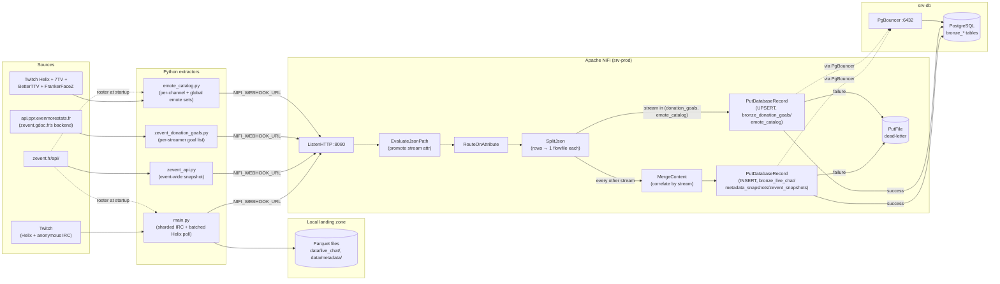
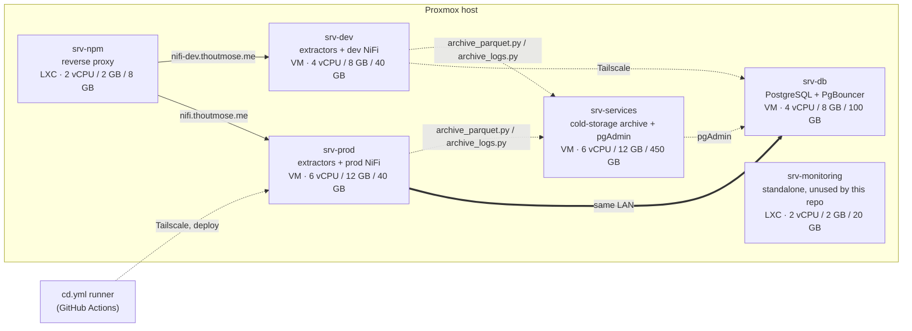

# zevent-analytics


[](https://github.com/thoutmose/zevent-analytics/actions/workflows/ci.yml)

**[English](README.md) · [Français](README.fr.md)**

Extracts live-stream data for every Twitch channel participating in
[Zevent](https://zevent.fr/) — chat, viewer counts, stream metadata, and the
event's own donation/streamer feed — and lands it in a PostgreSQL bronze
layer through an Apache NiFi ingestion pipeline, with a local Parquet copy
of everything along the way.

## Table of contents

- [Overview](#overview)
- [Architecture](#architecture)
- [Infrastructure](#infrastructure)
- [Design decisions](#design-decisions)
- [Reliability mechanisms](#reliability-mechanisms)
- [Performance](#performance)
- [Project structure](#project-structure)
- [Getting started](#getting-started)
  - [Prerequisites](#prerequisites)
  - [1. Register a Twitch application](#1-register-a-twitch-application)
  - [2. Configure environment variables](#2-configure-environment-variables)
  - [3. Bring up the NiFi stack](#3-bring-up-the-nifi-stack)
  - [4. Apply the database schema](#4-apply-the-database-schema)
  - [5. Build the NiFi flow](#5-build-the-nifi-flow)
  - [6. Run the extractors](#6-run-the-extractors)
- [Configuration reference](#configuration-reference)
- [Data model](#data-model)
- [Logging](#logging)
- [Development](#development)
- [Known limitations](#known-limitations)
- [Efficiency & stability recommendations](#efficiency--stability-recommendations)
- [Data transformation (dbt)](#data-transformation-dbt)
- [Data quality](#data-quality)
- [Data analysis](#data-analysis)

## Overview

Four independent extractors feed the same pipeline:

| Script | Watches | Source | Auth |
|---|---|---|---|
| [`main.py`](main.py) | Every channel in the current Zevent roster (300+) | Twitch Helix (batched polling) + anonymous IRC (sharded connections) | Device Code Flow, app-only |
| [`zevent_api.py`](zevent_api.py) | The whole event at once | [`zevent.fr/api/`](https://zevent.fr/api/), public/unauthenticated | none |
| [`zevent_donation_goals.py`](zevent_donation_goals.py) | Every streamer's donation goals | `api.ppr.evenmorestats.fr` (the JSON backend behind [`zevent.gdoc.fr/participations`](https://zevent.gdoc.fr/participations), public/unauthenticated) | none |
| [`emote_catalog.py`](emote_catalog.py) | Every channel's emote sets, plus each service's global set | Twitch Helix + [7TV](https://7tv.io/), [BetterTTV](https://betterttv.com/), [FrankerFaceZ](https://www.frankerfacez.com/) | Twitch: app-only; the third-party services are public/unauthenticated |

All four push their batches to an [Apache NiFi](https://nifi.apache.org/)
flow over HTTP (`NIFI_WEBHOOK_URL`) which routes, splits, and writes them
into PostgreSQL — see [`ARCHITECTURE.md`](ARCHITECTURE.md) for the full
design rationale (batching, backpressure, idempotency, dead-lettering). Left
unset, all four scripts still run standalone — `main.py` lands Parquet
files locally, the other three still write their local checkpoint — NiFi is
an additive sink, not a hard dependency.

`emote_catalog.py` fetches emote *catalogs* (which emote codes exist, per
channel/globally), not usage — it exists because Twitch's own IRC `emotes`
tag (captured directly by `main.py`, see `bronze_live_chat.emotes` below)
only covers native Twitch emotes. 7TV/BetterTTV/FrankerFaceZ are client-side
chat-extension overlays Twitch's IRC/API has zero knowledge of: a message
using one is just a plain-text token (e.g. `monkaS`) with no tag at all.
Matching that token against a channel's actual third-party emote set is a
dbt-side join against `bronze_emote_catalog`, not something this repo's
Python side computes.

`main.py` no longer targets a single hardcoded channel: it fetches the
current Zevent streamer list from `zevent.fr/api/` at startup and watches
all of them. EventSub (`stream.online`/`offline`, `channel.update`,
`channel.raid`) was dropped in favor of pure Helix polling once the channel
count crossed into the hundreds — subscribing to 3–4 events per channel
risks per-websocket subscription limits at that scale. Raids aren't tracked
as a result.

## Architecture



`srv-prod` runs the prod extractors alongside NiFi; PostgreSQL and PgBouncer
run on a separate `srv-db` and aren't managed by this repo. See
[`ARCHITECTURE.md`](ARCHITECTURE.md) for the deployment topology, the
reverse-proxy setup, and every deviation from the original design.

### The NiFi flow, processor by processor


A live capture of the flow above (dev instance) — the numbers on each
processor are 5-minute rolling stats, not fixed labels. Left to right, this
is the ingestion path every batch from all four extractors takes:

1. **`ListenHTTP`** — the ingestion endpoint (`NIFI_WEBHOOK_URL`). Each POST
   is one complete, self-contained batch envelope (`batch_id`, `stream`,
   `rows[]`) from one `nifi_client.push_batch` call, not a stream of
   individual events — there's nothing to correlate across requests.
2. **`EvaluateJsonPath`** — promotes the envelope's `$.stream` field
   (`live_chat` / `metadata` / `zevent_snapshot` / `donation_goals` /
   `emote_catalog`) onto the flowfile as an attribute, so the next step can
   route without re-parsing the body on every hop.
3. **`RouteOnAttribute`** — the only branch point in the flow, on that
   `stream` attribute: `insert` (the three append-only streams), `upsert`
   (`donation_goals` and `emote_catalog`, the two streams that overwrite in
   place), or `unmatched` for anything else.
4. **`SplitJson`** (one per branch) — expands the envelope's `rows[]` array
   into one flowfile per row. Each row already carries its own `batch_id` +
   `row_number` (set Python-side, see `nifi_client.py`) — that's what makes
   a re-sent batch idempotent at the database layer, not anything NiFi does.
5. **`MergeContent`** (insert branch only) — re-assembles same-`stream` rows
   that step 4 just split apart back into a batched JSON array, so
   `PutDatabaseRecord` issues one JDBC batch insert per bin instead of one
   row at a time. The upsert branch skips straight from `SplitJson` to
   `PutDatabaseRecord` — donation_goals/emote_catalog poll volume doesn't
   need it. See [`ARCHITECTURE.md`, step
   5b](ARCHITECTURE.md#5b-mergecontent--insert-branch-only-between-splitjson-insert-and-putdatabaserecord-insert).
6. **`PutDatabaseRecord`** (one per branch) — the sink. The INSERT branch
   picks its target table (`bronze_live_chat_staging` for `live_chat` /
   `bronze_metadata_snapshots` / `bronze_zevent_snapshots`) with a NiFi
   Expression Language ternary on the `stream` attribute, so one processor
   covers three tables instead of three near-identical ones — `live_chat`
   lands in an `UNLOGGED` staging table instead of `bronze_live_chat`
   directly, periodically folded in by a separate timer-driven `ExecuteSQL`
   (see [`ARCHITECTURE.md`, step
   8](ARCHITECTURE.md#8-executesql-merge-bronze_live_chat_staging--no-incoming-connection-timer-driven)).
   The UPSERT branch does the same table-picking trick between its two
   tables: `bronze_donation_goals` (`Update Keys = participation_id, goal_id`)
   or `bronze_emote_catalog` (`Update Keys = service, scope, channel,
   emote_id`). Both branches' Record Reader resolves an explicit Avro schema
   by `stream` name rather than inferring one — see
   [`ARCHITECTURE.md`, step 1b](ARCHITECTURE.md#1b-controller-service-avroschemaregistry-avroschemaregistry-ingest-streams).
7. **`UpdateAttribute`** — every failure path in the flow (`EvaluateJsonPath`
   failing on unparseable JSON, `RouteOnAttribute`'s `unmatched`, either
   `PutDatabaseRecord` failing to write) is unified here before touching
   disk, rewriting `filename` to `${filename}-${UUID()}`. This isn't
   decorative: `SplitJson` gives every row from one batch the *same*
   filename, and the next processor's conflict strategy is `fail` on a
   duplicate name — without a uniquifier, only the first failing row per
   batch ever reached disk and every other one was silently destroyed. See
   [`ARCHITECTURE.md`](ARCHITECTURE.md) for the numbers from when this was
   found.
8. **`PutFile` (dead-letter)** — one file per failed row, name now
   guaranteed unique, written to `nifi/dead-letter/` for manual replay (see
   [Known limitations](#known-limitations)) — not an automated retry.

Every connection here carries a 500,000 flowfile / 2 GB backpressure
threshold (raised from NiFi's 10,000 flowfile / 1 GB default — see
[`ARCHITECTURE.md`, "Tuning for higher
throughput"](ARCHITECTURE.md#tuning-for-higher-throughput) for why and the
throughput numbers behind it): it just doesn't render as a number on an idle
canvas — NiFi only color-codes a connection once its queue nears the
threshold. A flow definition for all of this ships at
[`flow-templates/zevent-ingest-flow.json`](flow-templates/zevent-ingest-flow.json)
(see [`ARCHITECTURE.md`](ARCHITECTURE.md) for how to import it).

## Infrastructure

Everything above — four extractors, NiFi routing, the PostgreSQL sink, and
cold-storage archival — runs on six guests on a single Proxmox host,
provisioned via cloud-init (`qm`/`pct`) with no Terraform/Ansible layer on
top. Real LAN addresses aren't listed here, same policy as
[`ARCHITECTURE.md`](ARCHITECTURE.md#topology) and for the same reason (this
file is committed to git) — resolve hosts by their Tailscale MagicDNS name.



| Host | Role | Type | vCPU | RAM | Disk |
|---|---|---|---|---|---|
| `srv-dev` | Dev machine — extractors + this repo's checkout + dev NiFi | VM | 4 | 8 GB | 40 GB |
| `srv-prod` | Prod machine — extractors + this repo's checkout + prod NiFi  | VM | 6 | 12 GB | 40 GB |
| `srv-db` | PostgreSQL + PgBouncer — not managed by this repo | VM | 4 | 8 GB | 100 GB |
| `srv-services` | Cold-storage target for [`archive_parquet.py`](archive_parquet.py)/[`archive_logs.py`](archive_logs.py), plus [pgAdmin](https://www.pgadmin.org/) (`dpage/pgadmin4`, port 5050) for ad-hoc Postgres administration | VM | 6 | 12 GB | 450 GB |
| `srv-npm` | Reverse proxy in front of `*.thoutmose.me` | LXC | 2 | 2 GB | 8 GB |
| `srv-monitoring` | Monitoring stack — standalone, not integrated with this repo | LXC | 2 | 2 GB | 20 GB |
| **Total** | | | **24** | **44 GB** | **658 GB** |

24 vCPU and 44 GB of RAM, split across 4 VMs and 2 LXC containers on one
physical box, is the entire footprint for ingesting ~300 channels' live
chat plus event-wide/donation-goal polling in real time, routing it through
NiFi, and sinking it to Postgres — see [Performance](#performance) for the
actual throughput (74 msg/s sustained, ~190 msg/s peak) that footprint
sustains.

## Design decisions

### Why Apache NiFi

The pipeline needs an HTTP ingestion endpoint, per-batch routing by data
type, and a database sink with a dead-letter path for failures. NiFi
provides all of that as configurable processors (`ListenHTTP`,
`RouteOnAttribute`, `PutDatabaseRecord`, `PutFile`) instead of code this
project would otherwise have to write and operate itself — a message
broker (Kafka or similar) would still need a consumer and a
database-writing sink built on top of it for the same result. The
trade-off is that NiFi's flow lives in its own UI/REST API rather than in
version-controlled code — mitigated here by documenting every processor's
configuration in [`ARCHITECTURE.md`](ARCHITECTURE.md) since no flow export
can be validated without a running instance to import it into.

### Why PostgreSQL + JSONB

PostgreSQL and PgBouncer were the given target (see
[`ARCHITECTURE.md`](ARCHITECTURE.md)), not something this project
evaluated against alternatives. It's a good fit for what's actually
needed: `UNIQUE (batch_id, row_number)` gives exactly-once semantics on
replay for free, and `jsonb` holds `zevent_api.py`'s per-streamer array
(`bronze_zevent_snapshots.streamers`) without a rigid one-column-per-field
schema. Nothing here is written to be queried at analytical scale — it's a
bronze/raw landing layer, not a warehouse.

### Why Parquet as a dual-write, not just a local cache

`main.py` wrote Parquet before NiFi/PostgreSQL entered the picture at all
— `nifi_client.py`'s own docstring calls it "an additive sink, not a
replacement". Keeping the Parquet write means the extraction survives
NiFi being down, misconfigured, or not deployed yet, and gives a
zstd-compressed local copy to re-derive from independent of the DB. It
also acts as the buffer during a NiFi outage: at the ~190 msg/s peak
estimated in [Reliability mechanisms](#reliability-mechanisms), even a
30-minute outage is only ~340K messages of chat, comfortably absorbed as
local Parquet. The trade-off is the two sinks can disagree if one push
fails and the other doesn't (see [Known limitations](#known-limitations))
— acceptable for a bronze layer that's meant to be replayed, not treated
as a single source of truth.

### Why `zevent_donation_goals.py` calls a JSON API instead of scraping HTML

`zevent.gdoc.fr/participations` is a client-rendered Nuxt SPA — its HTML
response carries no data at all, only a JS bundle that fetches everything
from `api.ppr.evenmorestats.fr` after the page loads. Scraping the rendered
page would mean running a headless browser just to read back JSON the page
itself already fetched over plain HTTP; calling that backend directly
(`/events`, `/events/{id}/donation_goals/overview`,
`/participations/{id}/donation_goals` — reverse-engineered from the SPA's JS
bundle) is lighter, faster, and exactly the same approach `zevent_api.py`
already takes against `zevent.fr/api/` instead of scraping `zevent.fr`.

Each goal also carries an `accomplished` flag (whether it's been met) —
dropped on purpose. This module tracks what the goals *are*, not how close
to met they are; `bronze_zevent_snapshots.total_donation_amount_eur`
(`zevent_api.py`) already covers overall progress.

Unlike the two append-only extractors above, this table is meant to reflect
only the *current* set of goals, not a history of every poll — see
`sql/002_donation_goals.sql` and [Data model](#data-model) for how that's
implemented (UPSERT, not INSERT) and its one known gap (removed goals aren't
deleted).

## Reliability mechanisms

Sized against Zevent 2025 — the same format Zevent 2026 follows: 327
channels, 55h of live, 751,889 peak viewers, 296,175 average viewers. At
Twitch's rough 1–3 chat messages/min per 100 viewers (the ratio drops as a
channel gets bigger — chat scrolls too fast to read, and slow-mode often
throttles the biggest ones further), that puts extraction/load at roughly
**74 msg/s sustained, ~190 msg/s at peak**, and the peak itself is a ramp
over tens of minutes (day/night viewer cycle) rather than a sudden spike —
there's no wall of traffic arriving in seconds to design around.

What's actually implemented and testable in this repo, as of the latest
multi-channel rewrite:

- **Idempotent replay** — every row carries `batch_id` + `row_number`;
  `UNIQUE (batch_id, row_number)` (`sql/001_bronze_schema.sql`) makes a
  re-sent batch a no-op instead of a duplicate.
- **Dead-lettering, not data loss** — `PutDatabaseRecord`'s `failure`
  relationship (and `RouteOnAttribute`'s `unmatched`) routes through an
  `UpdateAttribute` processor that rewrites `filename` to
  `${filename}-${UUID()}` before reaching `PutFile`, then lands in
  `nifi/dead-letter/`. The `UpdateAttribute` step matters because every row
  NiFi splits out of one source batch inherits that batch's original
  `filename` — without it, `PutFile`'s `fail`-on-conflict strategy plus its
  auto-terminated `failure` relationship meant only the *first* failing row
  per batch ever reached disk; every other one silently vanished (confirmed
  on the dev NiFi instance: 27,890 filename collisions logged against only
  164 files that actually survived in `nifi/dead-letter/`). If `srv-prod`'s
  NiFi flow was built the same way, it likely has the same gap and needs the
  same fix.
- **Graceful shutdown waits for in-flight pushes** —
  [`nifi_client.wait_for_pending_pushes`](nifi_client.py) is awaited
  before the event loop closes, so a NiFi push isn't cancelled mid-request
  (a cancelled-but-already-sent request is ambiguous — see that
  function's docstring for the double-insert this prevents).
- **IRC sharded across reconnecting connections, with jitter** — each
  [`ChatConnection`](main.py) covers `CHANNELS_PER_IRC_CONNECTION`
  channels and reconnects with jittered exponential backoff on drop (sleep
  somewhere in `[backoff, 2*backoff]`, capped at 60s, not exactly
  `backoff`), so one flaky connection only affects its own shard, and a
  shared outage across shards doesn't send every one of them back to
  Twitch in lockstep.
- **Zevent API checkpoint** — [`zevent_api.py`](zevent_api.py) has no
  Parquet dual-write, so `_write_checkpoint` persists the last
  successfully fetched snapshot to `ZEVENT_CHECKPOINT_PATH` (default
  `data/zevent_checkpoint.json`) after every poll, via a temp-file-plus-
  rename so a crash mid-write can't corrupt it. A restart, or a
  zevent.fr/api/ outage (it happened for ~17min during Zevent 2024),
  always leaves a recent known-good snapshot on disk.
- **Rate-limit-aware fan-out** — Helix calls (`Get Users`/`Get Streams`)
  are chunked to 100 logins per request (Twitch's own limit); IRC `JOIN`s
  are paced (`IRC_JOIN_PACING_SECONDS`) to stay under Twitch's per-10s
  connection limit.
- **NiFi's built-in per-connection backpressure** — every connection
  between processors has an object/size threshold NiFi enforces natively;
  synthetically load-tested on `srv-dev` (see [Performance](#performance)
  below), though not yet against real Zevent traffic.
- **Archival, not accumulation** —
  [`archive_parquet.py`](archive_parquet.py)/[`archive_logs.py`](archive_logs.py)
  are standalone, cron-run scripts (not part of the always-on extractors):
  each run bundles every eligible file into one tar.zst archive (see
  [`archive_common.py`](archive_common.py)), rsyncs that single bundle to
  `ARCHIVE_REMOTE_HOST`, confirms its sha256 matches the local bundle, and
  only then deletes the original local files — a transfer failure or hash
  mismatch leaves every original untouched and the whole batch is simply
  retried on the next run. `--dry-run` reports what would be archived/
  deleted without touching anything, given the delete step is irreversible.

## Performance

Real event numbers (throughput, dead-letter rate, IRC reconnect count per
shard, manual-restart count) are still not yet measured — Zevent hasn't
happened yet on this timeline, and this note will be filled in afterward
with real numbers pulled from `logging/` (see [Logging](#logging)) and
PostgreSQL itself, not projected ones.

What *has* been measured: a synthetic capacity/stress test of the
ingestion pipeline's ceiling, run against the dev NiFi instance (`srv-dev`,
`zevent-dev` database) on 2026-08-30 via `stress_test.py` — a ramping load
generator posting synthetic `live_chat` batches to `/ingest`. This
exercises the pipeline itself (webhook → NiFi → Postgres), not real Twitch
chat volume.

**This section is the first round of that testing and is kept as-is as a
historical record — later rounds (the `bronze_live_chat_staging` change, the
backpressure threshold going from 50,000 to 500,000, and the sustained-load
disk-exhaustion finding that qualifies it) are documented in
[`ARCHITECTURE.md`, "Tuning for higher
throughput"](ARCHITECTURE.md#tuning-for-higher-throughput) instead of here —
that's the current numbers, this is where they came from.**

### Baseline (NiFi's untuned defaults)

Every processor in the flow defaults to NiFi's `Concurrent Tasks = 1`; the
`DBCPConnectionPool` defaults to `Max Total Connections = 8`; every
inter-processor connection defaults to a 10,000-flowfile backpressure
threshold.

- **1 concurrent producer:** ~220 req/s (~4,400 rows/s) accepted, 0%
  errors, sustained.
- **≥2 concurrent producers:** immediate HTTP 503 from `ListenHTTP`,
  within ~5ms — confirmed via NiFi's own servlet response and logs, not a
  client-side artifact. Root cause: with every processor capped at 1
  concurrent task, the queue immediately downstream of `ListenHTTP` fills
  almost instantly, and `ListenHTTP` starts rejecting new connections
  outright instead of queuing them.
- **Practical risk this exposes:** `zevent-main.service`,
  `zevent-api.service`, and `zevent-donation-goals.service` all push to
  the same `NIFI_WEBHOOK_URL` independently. `nifi_client.push_batch`
  deliberately does not retry a definite HTTP-level rejection (only
  ambiguous timeouts — see [Reliability
  mechanisms](#reliability-mechanisms)), so two services posting at the
  same instant could silently drop one batch under this untuned default.

### After retuning

Changes applied live via the NiFi REST API (see the persistence caveat
below):

| Setting | Before | After |
|---|---|---|
| `ListenHTTP` / `PutDatabaseRecord (INSERT)` Concurrent Tasks | 1 | 8 |
| `EvaluateJsonPath` / `RouteOnAttribute` / `SplitJson (insert)` Concurrent Tasks | 1 | 4 |
| `SplitJson (upsert)` / `PutDatabaseRecord (UPSERT)` / dead-letter processors Concurrent Tasks | 1 | 2 |
| `DBCPConnectionPool` Max Total Connections | 8 | 24 |
| Connection backpressure object threshold | 10,000 | 50,000 |
| `nifi.content.repository.archive.max.retention.period` | 7 days | 2 minutes |
| `nifi.content.repository.archive.max.usage.percentage` | 50% | 90% |

Results:

- **Webhook acceptance:** clean (0% errors) up to concurrency=25, ~162,850
  rows/s, p50/p95/p99 latency 7/12/22ms.
- **Ceiling moved, not removed:** error rate crosses 20% at concurrency=50;
  full saturation (100% errors) at concurrency=100. The breaking point
  shifted from "any 2nd concurrent connection" to roughly 25–50 concurrent
  producers.
- **Sustained, steady-state database insert rate: ~2,700–3,000 rows/sec**,
  measured directly against `bronze_live_chat` row growth (not just
  HTTP-layer acceptance) — comfortably above the ~190 msg/s peak estimated
  in [Reliability mechanisms](#reliability-mechanisms).

### Stability findings

- **Content-repository archive throttling is a whole-partition check, not
  a NiFi-specific one.** `nifi.content.repository.archive.max.usage.percentage`
  compares against the entire filesystem NiFi's content repo lives on —
  on a disk already >50% full from unrelated data, sustained high-volume
  writes stall (`Unable to write flowfile content ... waiting for archive
  cleanup`) regardless of how little NiFi itself has archived. Hit this on
  `srv-dev` (a shared 38GB disk, ~69% used from non-NiFi data) well before
  NiFi's own footprint was meaningful (its archive was 1.64MB at the time).
- **Deep queues degrade throughput non-linearly.** Once a connection's
  queue passes NiFi's in-memory swap threshold (10,000 flowfiles), it
  starts swapping to disk; a backlog that oscillates around that threshold
  causes repeated swap-out/swap-in churn that dropped measured drain
  throughput from ~3,000 rows/s to ~60 rows/s. Keeping bursts under ~10K
  flowfiles deep (or raising the swap threshold alongside backpressure)
  avoids the cliff.
- **`DBCPConnectionPool`'s `Password` property is masked (`********`) on
  every `GET`.** Re-submitting a fetched `properties` dict verbatim on a
  `PUT` — even to change an unrelated property like pool size — silently
  overwrites the real password with that placeholder. Caused an
  ~8.5-minute production DB-write outage on `srv-dev` during this testing
  (12:45:36–12:54:05 UTC, 2026-08-30) before being caught and reverted.
  Any future scripted config change via the NiFi API must strip or
  re-supply sensitive properties explicitly, never round-trip them.

### Caveats

- These are synthetic capacity numbers from `srv-dev`, not real Zevent
  traffic — the real-event numbers noted at the top of this section are
  still pending.
- The retuned settings above were applied live via the NiFi REST API and a
  `nifi.properties` edit inside the running container. **Neither is
  persisted** — recreating the container (`docker compose up
  --force-recreate`, or any rebuild — a plain `docker restart` is fine)
  reverts both to NiFi's defaults, silently re-introducing the
  concurrency-of-1 ceiling. If these settings should be permanent, they
  need to move into the flow template
  (`flow-templates/zevent-ingest-flow.json`) and
  `docker-compose.yml`/a mounted `nifi.properties` respectively.

## Project structure

```
.
├── main.py                  # multi-channel Twitch extractor (chat + metadata)
├── zevent_api.py             # zevent.fr/api/ poller (event-wide snapshot)
├── zevent_donation_goals.py   # per-streamer donation goal poller
├── emote_catalog.py            # Twitch/7TV/BetterTTV/FrankerFaceZ emote set poller
├── archive_parquet.py        # moves old local Parquet files to cold storage (cron)
├── setup_archive.sh          # one-time SSH+cron setup for archive_parquet.py
├── nifi_client.py             # shared HTTP push helper (batching, retries-safe)
├── logging_setup.py           # loads logging.yaml, picks dev/prod handler profile
├── logging.yaml                # rotating file handlers + colored console
├── sql/001_bronze_schema.sql    # PostgreSQL bronze tables (applied on srv-db)
├── sql/002_donation_goals.sql    # bronze_donation_goals (latest-state, UPSERT)
├── sql/003_live_chat_chatter_attributes.sql  # bronze_live_chat + badges/user_type/account_created_at/broadcaster_type
├── sql/004_live_chat_emotes.sql   # bronze_live_chat + emotes (native Twitch, from IRC tags)
├── sql/005_emote_catalog.sql       # bronze_emote_catalog (latest-state, UPSERT)
├── dbt/                             # transformation layer: bronze_* -> stg/int/marts
│   ├── models/staging/                # 1:1 typed views over bronze_*
│   ├── models/intermediate/           # joins, window functions, aggregations
│   ├── models/marts/                  # the analysis surface — see Data analysis
│   └── dbt_project.yml, profiles.yml, packages.yml
├── run_dbt.sh                         # invoked by dbt (manual) workflow / by hand
├── docker-compose.yml              # local NiFi stack (srv-prod only)
├── nifi/dead-letter/                 # PutDatabaseRecord failures land here
├── drivers/                            # PostgreSQL JDBC driver, mounted into NiFi
├── openapi.yaml                          # every external Twitch API call, documented
├── ARCHITECTURE.md                         # target production pipeline, in depth
├── DEPLOYMENT.md                             # CD setup: secrets, srv-prod access
├── .github/workflows/                          # CI, CD (srv-prod), dbt (manual)
└── data/                                         # local Parquet output (gitignored)
```

## Getting started

### Prerequisites

- Python 3.12+ and [uv](https://docs.astral.sh/uv/)
- Docker + Docker Compose (for the local NiFi stack)
- A reachable PostgreSQL instance behind PgBouncer (see
  [`ARCHITECTURE.md`](ARCHITECTURE.md) — not provisioned by this repo)

### 1. Register a Twitch application

At https://dev.twitch.tv/console/apps — set **Category** to `Application
Integration` and **Client Type** to `Public` (Device Code Flow needs a
public client, no client secret).

### 2. Configure environment variables

```bash
cp .env.example .env
```

Fill in `TWITCH_CLIENT_ID` at minimum. See
[Configuration reference](#configuration-reference) below for everything
else — most have sane defaults.

### 3. Bring up the NiFi stack

```bash
uv sync
docker compose up -d
```

NiFi's UI/API is served over HTTPS at `https://localhost:8443` (self-signed
cert; single-user login only works over HTTPS — see
[`ARCHITECTURE.md`](ARCHITECTURE.md#4-notes-on-this-implementation-deviations-from-the-original-spec)
for why). The data-ingestion port (`ListenHTTP`) is `localhost:8888`.

### 4. Apply the database schema

```bash
psql "postgresql://<user>@<srv-db-host>:5432/zevent" -f sql/001_bronze_schema.sql
psql "postgresql://<user>@<srv-db-host>:5432/zevent" -f sql/002_donation_goals.sql
psql "postgresql://<user>@<srv-db-host>:5432/zevent" -f sql/003_live_chat_chatter_attributes.sql
psql "postgresql://<user>@<srv-db-host>:5432/zevent" -f sql/004_live_chat_emotes.sql
psql "postgresql://<user>@<srv-db-host>:5432/zevent" -f sql/005_emote_catalog.sql
```

`003` and `004` `ALTER TABLE bronze_live_chat` — unlike `001`/`002`/`005`,
which only ever create new tables, that means the `PutDatabaseRecord`
(INSERT) processor built in step 5 below needs restarting *after* applying
them, or its cached table schema silently drops the new columns. See either
file's header comment, or
[`ARCHITECTURE.md`, step 6a](ARCHITECTURE.md#6a-putdatabaserecord--insert-branch-insert-relationship),
for why.

### 5. Build the NiFi flow

This repo doesn't ship an exported NiFi template (a hand-authored one can't
be validated without a running instance to import it into). Build it per
the [Architecture](#architecture) diagram above — `ListenHTTP` →
`EvaluateJsonPath` → `RouteOnAttribute` → `SplitJson` → `PutDatabaseRecord`
(+ dead-letter `PutFile` on failure); the insert branch additionally passes
through `MergeContent` between `SplitJson` and `PutDatabaseRecord` (see
[`ARCHITECTURE.md`, step 5b](ARCHITECTURE.md#5b-mergecontent--insert-branch-only-between-splitjson-insert-and-putdatabaserecord-insert)).
Full processor
configuration is in [`ARCHITECTURE.md`](ARCHITECTURE.md#2-how-the-pieces-in-this-repo-map-onto-the-diagram).
The `donation_goals` and `emote_catalog` streams share one `PutDatabaseRecord`
branch (routed by `RouteOnAttribute` on `stream in ('donation_goals',
'emote_catalog')`) configured with **Statement Type: UPSERT** and a
per-stream **Update Keys** expression — see `sql/002_donation_goals.sql` /
`sql/005_emote_catalog.sql`, or
[`ARCHITECTURE.md`, step 6b](ARCHITECTURE.md#6b-putdatabaserecord--upsert-branch-upsert-relationship)
for the exact expressions — every other stream uses plain `INSERT`.

### 6. Run the extractors

```bash
uv run main.py                    # every Zevent channel: chat + metadata
uv run zevent_api.py              # event-wide snapshot (donations, viewer counts)
uv run zevent_donation_goals.py   # every streamer's donation goal list
uv run emote_catalog.py           # every channel's Twitch/7TV/BetterTTV/FrankerFaceZ emote sets
```

Each is independent — run any subset of them. On first run, `main.py`
prints a Device Code Flow URL: open it, log in, authorize. The token is
cached in `.tio.tokens.json` so later runs don't need to re-authorize
(as long as the process shuts down cleanly — see
[`nifi_client.wait_for_pending_pushes`](nifi_client.py)).

### Running as a service (start/stop)

For a long-running event (Zevent runs ~55h), the three extractors run as
systemd services rather than a foreground `uv run`. Dev and prod are two
entirely separate checkouts on two separate machines — `twitch-analytics` on
`srv-dev`, pointing at srv-dev's own local NiFi (`zevent-dev` database), and
`twitch-analytics-prod` on `srv-prod`, pointing at srv-prod's own local NiFi
(`zevent` database) — each with its own `.env`. Each checkout has its own
`.tio.tokens.json`, so each needs its own one-time Twitch device-code
approval. On srv-prod, that same checkout is also where CD deploys to: the
NiFi stack (`docker-compose.yml` + `drivers/`), the Python extractors and
archive scripts (source, `sql/`, dependency files), and — via a narrowly
scoped sudoers grant for the deploy user — a `uv sync` plus a restart of the
three `zevent-*-prod` systemd units (see DEPLOYMENT.md); on srv-dev, both
NiFi and the extractors are set up and updated by hand in its own checkout,
just without CD.

```bash
# Start (dev):
sudo systemctl start zevent-api zevent-donation-goals zevent-main

# Start (prod):
sudo systemctl start zevent-api-prod zevent-donation-goals-prod zevent-main-prod

# Stop — either environment, same pattern with/without the -prod suffix:
sudo systemctl stop zevent-api zevent-donation-goals zevent-main

# Status / follow logs for one service:
sudo systemctl status zevent-main
sudo journalctl -u zevent-main -f

# Prevent a stopped service from coming back on the next reboot:
sudo systemctl disable zevent-api-prod zevent-donation-goals-prod zevent-main-prod
```

All six are `Restart=on-failure` — a crash restarts automatically, a manual
`stop` does not (until the next reboot, unless also `disable`d).

**`emote_catalog.py` has no systemd unit yet.** Unlike the three extractors
above, it isn't part of these `start`/`stop` commands, DEPLOYMENT.md's
sudoers grant, or `cd.yml`'s "restart zevent services" step — for a real
event it needs its own `zevent-emote-catalog[-prod].service` (same template
as the other three) added to all three places, or it has to be run by hand
(`uv run emote_catalog.py`, backgrounded) instead.

### Archiving old Parquet files and log backups

[`archive_parquet.py`](archive_parquet.py) and
[`archive_logs.py`](archive_logs.py) are one-shot maintenance scripts, not
services — neither is installed or scheduled by anything in this repo on
its own. Both share the same tar+zstd bundle + verify + delete-on-confirm
mechanics (see [`archive_common.py`](archive_common.py)) and the same
`ARCHIVE_REMOTE_HOST`, just different destination directories: every file
found eligible in one run is bundled into a single dated
`<prefix>-<timestamp>.tar.zst` archive (e.g.
`parquet-20260830T085635Z.tar.zst`), transferred as that one file, verified
by sha256, and only then has its originals deleted locally — real
cold-storage semantics (one dated bundle per run) rather than many small
files landing individually, and fewer round trips at scale. The trade-off:
verification and deletion apply to the whole batch at once, not per file —
if any step fails, every original in that run's batch is left untouched
(not just one), to be retried as part of the next run's (larger) batch.

- `archive_parquet.py`: Parquet files older than `ARCHIVE_MIN_AGE_SECONDS`
  under `PARQUET_OUTPUT_DIR`, to `ARCHIVE_REMOTE_PATH`.
- `archive_logs.py`: closed/rotated log backups under `logging/` (e.g.
  `debug.log.3`, `debug.log.3.gz`) — never the active files
  [`logging.yaml`](logging.yaml)'s handlers are currently writing to — to
  `ARCHIVE_LOGS_REMOTE_PATH`. There's no age guard here the way Parquet
  needs one: a rotated backup is immutable from the moment it exists, since
  `CompressedRotatingFileHandler` never writes to one again.

#### One-time setup (per machine)

Run [`./setup_archive.sh`](setup_archive.sh) once on each machine that will
run either script (dev box, `srv-prod`, or wherever the extractors actually
run — see [Running as a service](#running-as-a-service-startstop)). It's
idempotent — every step checks the current state first, so re-running it (a
second machine, a key rotation, after pulling a newer version of the
script) never duplicates anything:

```bash
./setup_archive.sh
```

It handles, in order: generating a dedicated SSH key for this purpose if one
doesn't already exist; adding a `Host srv-services` alias to `~/.ssh/config`
so `ARCHIVE_REMOTE_HOST=srv-services` (the default in `.env.example`)
resolves without an explicit `-i` flag anywhere; verifying key-based auth
actually works; installing both scripts' hourly cron jobs (see
[Running it](#running-it) below); and a check that warns if a `*-prod`
checkout's `.env` doesn't have `APP_ENV=production` set (see
[Logging](#logging)) — everything except the logging check is silent when
already correctly set up.

The one step it can't do unattended: if the SSH key it generates isn't yet
authorized on `srv-services`, it prints the exact `ssh-copy-id` command to
run once (needs some existing way in — an already-authorized key, or a
one-time password from whoever manages that server) and exits; re-run
`./setup_archive.sh` afterward to pick up where it left off.

Once SSH access works, `ARCHIVE_REMOTE_PATH` and `ARCHIVE_LOGS_REMOTE_PATH`
(see [Configuration reference](#configuration-reference)) are each created
automatically on srv-services the first time their script actually has a
file to send there — nothing to create manually ahead of time.

#### Running it

`./setup_archive.sh` already installs both of these; shown here for
reference or to adjust manually:

```bash
# Keeps each run's candidate set small, which matters for SSH-call overhead
# — see each script's own module docstring. Logs go through the same
# logging_setup.py profile (APP_ENV) as the other scripts, so failures also
# show up in logging/errors.log (until archive_logs.py itself archives that
# backup, at which point it's on srv-services instead).
0 * * * * cd /path/to/twitch-analytics && uv run archive_parquet.py >> /dev/null 2>&1
0 * * * * cd /path/to/twitch-analytics && uv run archive_logs.py >> /dev/null 2>&1
```

## Configuration reference

All variables live in `.env` (see [`.env.example`](.env.example) for the
authoritative, commented list). Highlights:

| Variable | Default | Purpose |
|---|---|---|
| `TWITCH_CLIENT_ID` | *(required)* | Twitch app client ID |
| `CHANNELS_PER_IRC_CONNECTION` | `50` | Channels per anonymous IRC connection (sharded across `ceil(n / this)` connections) |
| `IRC_JOIN_PACING_SECONDS` | `0.5` | Delay between IRC `JOIN`s, to respect Twitch's rate limit |
| `METADATA_SNAPSHOT_INTERVAL_SECONDS` | `15` | Batched Helix poll interval (all channels, all metadata) |
| `ROSTER_REFRESH_INTERVAL_SECONDS` | `15` | How often `main.py` re-fetches the roster to pick up new streamers mid-event |
| `CHATTER_LOOKUP_INTERVAL_SECONDS` | `30` | How often unresolved chatters get a batched Helix Get Users lookup (`account_created_at`/`broadcaster_type`) |
| `ZEVENT_API_POLL_INTERVAL_SECONDS` | `20` | `zevent.fr/api/` poll interval |
| `FLUSH_INTERVAL_SECONDS` | `30` | How often buffered rows are flushed to Parquet/NiFi |
| `MAX_ROWS_PER_PARQUET_FILE` | `100000` | Row cap before a Parquet file rolls over |
| `PARQUET_COMPRESSION` | `zstd` | Codec passed to `pyarrow.parquet.write_table` |
| `PARQUET_OUTPUT_DIR` | `data` | Local Parquet landing zone |
| `ARCHIVE_REMOTE_HOST` | `srv-services` | SSH destination for `archive_parquet.py`/`archive_logs.py` (recommend an `~/.ssh/config` alias) |
| `ARCHIVE_REMOTE_PATH` | `zevent-parquet-archive` | Remote directory archived Parquet files land in |
| `ARCHIVE_MIN_AGE_SECONDS` | `600` | Minimum file age before `archive_parquet.py` will archive it |
| `ARCHIVE_LOGS_REMOTE_PATH` | `zevent-logs-archive` | Remote directory archived log backups land in |
| `NIFI_WEBHOOK_URL` | *(unset)* | NiFi `ListenHTTP` endpoint; unset = Parquet/stdout only |
| `APP_ENV` | `development` | Logging profile — see [Logging](#logging) |
| `NIFI_ADMIN_USERNAME` / `NIFI_ADMIN_PASSWORD` | — | NiFi UI single-user login (docker-compose) |
| `DONATION_GOALS_POLL_INTERVAL_SECONDS` | `300` | `zevent_donation_goals.py` poll interval |
| `DONATION_GOALS_MAX_CONCURRENCY` | `5` | Max concurrent per-streamer goal-detail requests |
| `EMOTE_CATALOG_POLL_INTERVAL_SECONDS` | `1800` | `emote_catalog.py` poll interval — emote sets are effectively static, unlike everything else this repo polls |
| `EMOTE_CATALOG_MAX_CONCURRENCY` | `10` | Max concurrent per-channel emote-set requests (across all four services combined) |
| `POSTGRES_HOST` / `PGBOUNCER_PORT` / `POSTGRES_DB` / `POSTGRES_USER` / `POSTGRES_PASSWORD` | — | Not read by any Python script — only `dbt/profiles.yml` (`env_var()`) and, for humans, NiFi's `DBCPConnectionPool` config |
| `DBT_TARGET` | `dev` | Which `dbt/profiles.yml` output to use — `dev` = `zevent-dev`, `prod` = `zevent` (see [Data transformation (dbt)](#data-transformation-dbt)) |

## Data model

Five tables in PostgreSQL, one per `stream` value pushed through NiFi.

`bronze_live_chat`, `bronze_metadata_snapshots`, and
`bronze_zevent_snapshots` (`sql/001_bronze_schema.sql`) are append-only:
every row carries `batch_id` + `row_number`, and `UNIQUE (batch_id,
row_number)` makes a replayed batch a no-op instead of a duplicate.

| Table | Fed by | Notable columns |
|---|---|---|
| `bronze_live_chat` | `main.py` (IRC) | `channel`, `chatter`, `chatter_id`, `message_text`, `message_sent_at`, `captured_at`, `badges` (`jsonb`, parsed from the IRC `badges` tag — e.g. `moderator`, `subscriber`, `vip`, `founder`, `partner`, `turbo`, `premium`, `broadcaster`, `staff`, `admin`), `user_type` (IRC `user-type` tag: `staff`/`admin`/`global_mod`/empty), `emotes` (`jsonb`, `{emote_id: occurrence_count}` parsed from the IRC `emotes` tag — native Twitch emotes only; third-party emotes have no tag at all, see `bronze_emote_catalog` below), `account_created_at`, `broadcaster_type` (`affiliate`/`partner`/empty — both via a cached Helix Get Users lookup, see `CHATTER_LOOKUP_INTERVAL_SECONDS`) |
| `bronze_metadata_snapshots` | `main.py` (Helix poll) | `channel`, `is_live`, `title`, `category`, `viewer_count`, `duration_seconds`, `stream_started_at`, `snapshot_at` |
| `bronze_zevent_snapshots` | `zevent_api.py` | `website_mode`, `total_donation_amount_eur`, `total_viewer_count`, `streamers` (`jsonb`: `twitch_id`, `twitch_login`, `display_name`, `profile_url`, `online`, `game`, `viewer_count`, `donation_amount_eur` per streamer) |

`bronze_donation_goals` (`sql/002_donation_goals.sql`) is different: it
holds only the *current* set of goals, not a history of every poll.
`UNIQUE (participation_id, goal_id)` is the NiFi `PutDatabaseRecord` UPSERT
key (see [step 5](#5-build-the-nifi-flow)), so a re-poll overwrites each
goal's row in place.

| Table | Fed by | Notable columns |
|---|---|---|
| `bronze_donation_goals` | `zevent_donation_goals.py` | `participation_id`, `streamer_name`, `twitch_login`, `twitch_id`, `goal_id`, `goal_name`, `goal_amount_eur`, `goal_category`, `snapshot_at` |

`bronze_emote_catalog` (`sql/005_emote_catalog.sql`) is the same shape of
problem: only the *current* emote set per service/channel, not a history.
`UNIQUE (service, scope, channel, emote_id)` is the UPSERT key. `channel` is
deliberately `NOT NULL` — a `'__global__'` sentinel for `scope = 'global'`
rows, not `NULL` — since Postgres treats `NULL` as distinct from `NULL` in a
`UNIQUE` constraint, which would silently turn every re-poll of the global
sets into fresh duplicate inserts instead of in-place updates. See that
file's header comment.

| Table | Fed by | Notable columns |
|---|---|---|
| `bronze_emote_catalog` | `emote_catalog.py` | `service` (`twitch`/`7tv`/`bttv`/`ffz`), `scope` (`global`/`channel`), `channel`, `emote_id`, `emote_code`, `fetched_at` |

## Logging

Configured centrally by [`logging_setup.py`](logging_setup.py) from
[`logging.yaml`](logging.yaml) — every module logger (`zevent_extractor`,
`nifi_client`, `zevent_api`, `zevent_donation_goals`, `emote_catalog`,
`twitchio.*`) propagates to the root logger, which is what actually determines where
output goes.

Two profiles, selected via `APP_ENV`:

- **`development`** (default) — colored console, plus rotating files under
  `logging/`: `info.log`, `warn.log`, `errors.log`, `critical.log`,
  `debug.log`.
- **`production`** — console + `logging/info.log` only.

Each file rotates at 10 MB, keeping 20 backups.

## Development

```bash
uv sync --group dev     # ruff, ty, sqlfluff, pytest, bandit, pip-audit

uv run ruff format .    # formatting
uv run ruff check .     # linting
uv run ty check .       # static type checking
uv run sqlfluff lint sql/  # SQL lint
uv run pytest            # unit tests (tests/)
uv run bandit -c pyproject.toml -r .  # static security lint
uv run pip-audit --strict             # dependency vulnerability scan
```

All of the above are expected to pass clean on every file in this repo — CI
([`.github/workflows/ci.yml`](.github/workflows/ci.yml)) runs the same
checks, plus OpenAPI lint, `docker-compose.yml`/YAML validation, and secret
scanning, on every push and pull request. CD
([`.github/workflows/cd.yml`](.github/workflows/cd.yml)) deploys the NiFi
stack, the Python extractors, and the archive scripts to srv-prod after CI
passes on `main` — refreshing dependencies and restarting the three
`zevent-*-prod` systemd units — gated by manual approval — see
[`DEPLOYMENT.md`](DEPLOYMENT.md) for setup and how it works.

## Known limitations

- **Parquet and PostgreSQL can drift.** The Parquet file is written first,
  then pushed to NiFi — if that push fails or times out, the row exists
  locally but not (yet, or ever) in Postgres. Failures NiFi does receive
  land in `nifi/dead-letter/` for manual replay; nothing reconciles the two
  sinks automatically.
- **Roster additions are live, removals aren't.** `main.py` re-fetches the
  roster every `ROSTER_REFRESH_INTERVAL_SECONDS` (default 15s) and starts
  watching any new streamer without a restart (`_roster_refresh_loop`,
  `_refresh_roster`) — but a streamer that drops out of `zevent.fr/api/` is
  never un-watched; its IRC connection and Helix polling keep running until
  the process restarts. Deliberate: a channel missing from one response is
  far more likely a transient API hiccup than a real withdrawal, and a
  streamer who actually stopped already shows up as offline via the
  metadata snapshot.
- **No raid tracking.** Dropped along with EventSub when the channel count
  made per-channel subscriptions impractical (see [Overview](#overview)).
- **No donation *count*.** `zevent.fr/api/` exposes cumulative donation
  *amount* only, per streamer and event-wide — not a count of individual
  donations. `stats.zevent.fr` has more detail but sits behind an
  interactive bot-challenge that isn't scripted around here.
- **No "viewer typology"** (lurker vs. chatter, new vs. returning) — Twitch
  doesn't expose a full viewer list, only active chatters, and only via a
  moderator-only endpoint.
- **Removed donation goals aren't deleted.** `bronze_donation_goals` is kept
  current via UPSERT, keyed on `(participation_id, goal_id)` — if a goal is
  later pulled from `zevent.gdoc.fr` upstream, its row simply stops being
  updated rather than being removed. Not expected to matter in practice
  (goals are observed to only be added as the event approaches), but a
  stale row would need a manual `DELETE`.
- **Removed emotes aren't deleted either**, for the same reason.
  `bronze_emote_catalog` is UPSERT-kept-current, keyed on `(service, scope,
  channel, emote_id)` — an emote deleted or renamed upstream (by Twitch,
  7TV, BetterTTV, or FrankerFaceZ) leaves a stale row rather than removing
  it, since none of the four sources expose a "what changed" endpoint to
  detect that from.
- **`api.ppr.evenmorestats.fr` is undocumented and unofficial.** It's the
  backend `zevent.gdoc.fr` (a third-party companion site, not run by Zevent
  itself) happens to call — reverse-engineered from its JS bundle, not a
  published/versioned API. It could change shape or move without notice;
  `zevent_donation_goals.py` isn't insulated against that beyond normal
  `aiohttp.ClientError` handling.

## Efficiency & stability recommendations

Not implemented — a review of what's genuinely missing, on top of what's
already covered in [Reliability mechanisms](#reliability-mechanisms) and
[Known limitations](#known-limitations) above:

- **Local-disk exhaustion isn't monitored.** If `ARCHIVE_REMOTE_HOST`
  becomes unreachable for an extended stretch, `archive_parquet.py`
  correctly leaves files in place rather than losing them (see
  [Reliability mechanisms](#reliability-mechanisms)) — but nothing alerts on
  `data/` growing unbounded in the meantime. A full local disk silently
  stops new Parquet writes (and, downstream, new NiFi pushes) rather than
  failing loudly. Worth a simple disk-usage check (cron or a NiFi/Postgres-
  side alert) once `archive_parquet.py` is in regular use.
- **Parquet/Postgres drift has no reconciliation.** Already flagged as a
  known limitation; concretely, a periodic job comparing Parquet row counts
  (or `batch_id`s) against `bronze_*` tables would turn "nothing reconciles
  the two sinks automatically" into a detectable, not just theoretical, gap.
- **No metrics distinct from log files.** Throughput, dead-letter rate, and
  reconnect counts (see [Performance](#performance)) are all meant to be
  pulled from `logging/` and PostgreSQL after the fact — there's no live
  counter/gauge surface during the event itself, so a developing problem
  (e.g. a stuck IRC shard) is only visible by tailing logs, not by
  glancing at a dashboard.
- **PgBouncer's own pool sizing is still unverified under real load.**
  NiFi's per-connection backpressure and its `DBCPConnectionPool` sizing
  have now been synthetically load-tested (see
  [Performance](#performance) — ~2,700–3,000 rows/s sustained), but that
  only exercises NiFi's side of the JDBC connection; PgBouncer's own pool
  config on `srv-db` (not managed by this repo) against that same
  throughput hasn't been separately verified.

## Data transformation (dbt)

`dbt/` transforms `bronze_*` (in `public`, fed by the four extractors above)
into three schemas — `stg`/`int`/`marts`, not the dbt-default
`<target_schema>_stg` naming (see `dbt/macros/generate_schema_name.sql`).
Postgres adapter (`dbt-postgres`), same connection details as the extractors
(`POSTGRES_HOST`/`PGBOUNCER_PORT`/`POSTGRES_DB`/`POSTGRES_USER`/
`POSTGRES_PASSWORD` — see [Configuration reference](#configuration-reference)),
read via `env_var()` in `dbt/profiles.yml`, which is safe to commit (no
literal credentials in it) and targets `dev` (`zevent-dev`) by default,
`prod` (`zevent`) via `DBT_TARGET=prod`.

```bash
uv sync --group dbt
set -a && source .env && set +a   # dbt/profiles.yml reads these via env_var()
cd dbt
uv run dbt deps    # installs packages.yml: dbt-utils, dbt-expectations, elementary
uv run dbt build   # runs every model + test, staging through marts
```

- **`stg_bronze__*`** (5 models): 1:1 typed views over each `bronze_*`
  table, plus one real transformation —
  `stg_bronze__zevent_snapshots` unnests the `streamers` jsonb array into
  one row per streamer per snapshot.
- **`int_*`** (15 models): the actual joins/window functions/aggregations —
  donation deltas and leaderboard rank from successive snapshots, hourly
  chat/viewership rollups, chatter-level and chatter×channel aggregates,
  emote usage (native Twitch + third-party token-matched against
  `bronze_emote_catalog`), inferred channel-hops, and event-wide
  channel-pair audience overlap (Jaccard).
- **`mart_*`** (33 models): the actual analysis surface — see below.

Two project-level `vars` (`dbt/dbt_project.yml`) keep judgment calls tunable
without touching SQL: `chatter_profile_*_max_channels` (the
sedentaire/multi_streamer/semi_nomade/nomade thresholds) and
`chatter_migration_max_gap_minutes` (how close two messages in different
channels have to be to count as one inferred hop).

**dbt does not run automatically, anywhere, ever** — no `on-commit`/`on-push`
hook, no CI step, no schedule. Locally, it's the `uv run dbt build` above.
On srv-prod, it's the [`dbt (manual)`](.github/workflows/dbt.yml) GitHub
Actions workflow — `workflow_dispatch` only, triggered from the Actions tab
whenever someone decides to, never chained off CI or CD — see
[DEPLOYMENT.md, "Running dbt"](DEPLOYMENT.md#running-dbt). CD's normal
deploy still syncs `dbt/`'s code to srv-prod on every merge to `main` (see
[DEPLOYMENT.md](DEPLOYMENT.md)); that sync and actually running dbt are two
separate, deliberately decoupled actions.

## Data quality

Every model above carries tests, run as part of `dbt build`: generic
(`unique`, `not_null`, `accepted_values`), `dbt_utils.unique_combination_of_columns`
on every model's real grain (e.g. `(chatter_id, channel)`, `(service, scope,
channel, emote_id)`), and `dbt_expectations` range checks on values that
should never go negative (e.g. `donation_delta_eur >= 0`). `elementary` runs
alongside every `dbt build` (its own models are part of the DAG) for
anomaly-detection groundwork, though it needs repeated runs over time to
build a baseline — a single run doesn't have historical data to compare
against yet.

Two known data-quality findings surfaced *by* these tests/models, not by
inspection:

- **`stress_test.py`'s load-test channels can leak into real analysis** if
  its own suggested cleanup (`DELETE FROM bronze_live_chat WHERE channel =
  'stress-test-...'`, printed by the script itself) isn't run — a
  `stress-test-*` channel showed up in `mart_chat__engagement_vs_donations`
  with millions of messages in a single hour during development. Not
  filtered out in `stg_bronze__live_chat` by default; add a `WHERE channel
  NOT LIKE 'stress-test-%'` there if load tests and real analysis need to
  coexist in the same database.
- **`mart_donations__reconciliation`** (event-wide total vs. sum of
  per-streamer amounts, per snapshot) is exactly this kind of check turned
  into a queryable mart rather than a one-off comparison — divergence would
  mean donations landed on the event's global pot without being attributed
  to any streamer.

## Data analysis

The `mart_*` layer is the actual analysis surface — every mart below is a
`SELECT` away, no aggregation left to do client-side (matching the
`Streamlit`/`st.cache_data`-on-pre-aggregated-queries direction sketched
before this layer existed).

| Topic | Marts | Covers |
|---|---|---|
| Donations | `donations__timeseries`, `donations__by_title`, `donations__normalized`, `donations__spike_moments`, `donations__rank_churn`, `donations__reconciliation`, `donation_goals__current`, `donation_goals__by_category`, `donations__goal_ambition_vs_reality` | Totals + velocity over time, which titles/categories drew the most, per-viewer/per-chatter efficiency, the biggest velocity spikes with context, leaderboard volatility, event-total-vs-sum-of-parts data-quality check, current goals and their categories |
| Chat | `chat__engagement_vs_donations`, `chat__emote_trends`, `chat__new_chatters_per_channel`, `chat__badge_and_verbosity`, `chat__spikes` | Message volume vs. donation velocity (the sizing assumption behind this project's own reliability model, tested against real data), emote trends (native + 7TV/BetterTTV/FrankerFaceZ), chat-audience growth per channel, badge/subscriber population mix and verbosity, per-channel activity spikes (z-score against the channel's own baseline) |
| Chatters | `chatters__profile`, `chatters__leaderboard`, `chatters__account_age_profile`, `chatters__retention`, `chatters__breadth_depth_lifespan`, `chatters__bot_signal` | sedentaire/multi_streamer/semi_nomade/nomade classification, per-channel and event-wide rank, account-age buckets, day-over-day return behavior, breadth-vs-depth and lifespan, weak bot/throwaway-account signals (not a classifier) |
| Streamers/streams | `streamers__profile`, `streamers__diurnal_profile`, `streamers__night_shift`, `streams__viewership_timeseries`, `streams__category_timeline`, `streams__session_analysis`, `streams__category_cooccurrence`, `streams__concurrency_vs_performance` | One-row-per-streamer summary (donations/chat/viewership/uptime/category diversity in one place), viewer count indexed against the event-wide hour-of-day baseline (separates "big at 9pm" from genuinely outsized), overnight donation efficiency, viewer rank over time, category/title change annotations, per-session duration/viewer-decay/chat-pace/donations, which games were played simultaneously across channels, concurrency vs. per-channel performance |
| Community/cross-cutting | `community__channel_network`, `community__hourly_network`, `community__chatter_migrations`, `event__daily_rollup`, `event__phase_segmentation` | Event-wide channel-to-channel audience overlap (Jaccard — which streamers effectively share one audience), hourly version of the same, inferred channel-hop flow graph (closest available proxy to the raid data EventSub would have given), daily rollup across the event, opening/middle/final-push donation velocity segmentation |

Two things every mart in this table inherits from what's underneath it,
worth restating here rather than only in each model's own comment: they
represent chatters who **wrote**, not the full audience (Twitch exposes no
silent-viewer list — see [Known limitations](#known-limitations)), and
`bronze_donation_goals`/`bronze_emote_catalog` are both UPSERT/latest-state,
so nothing derived from them has real history before the row was first
observed.
